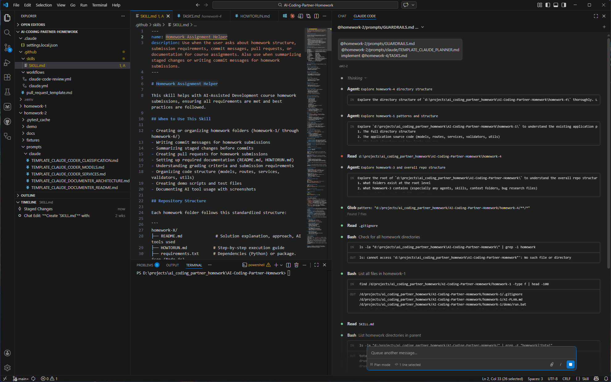
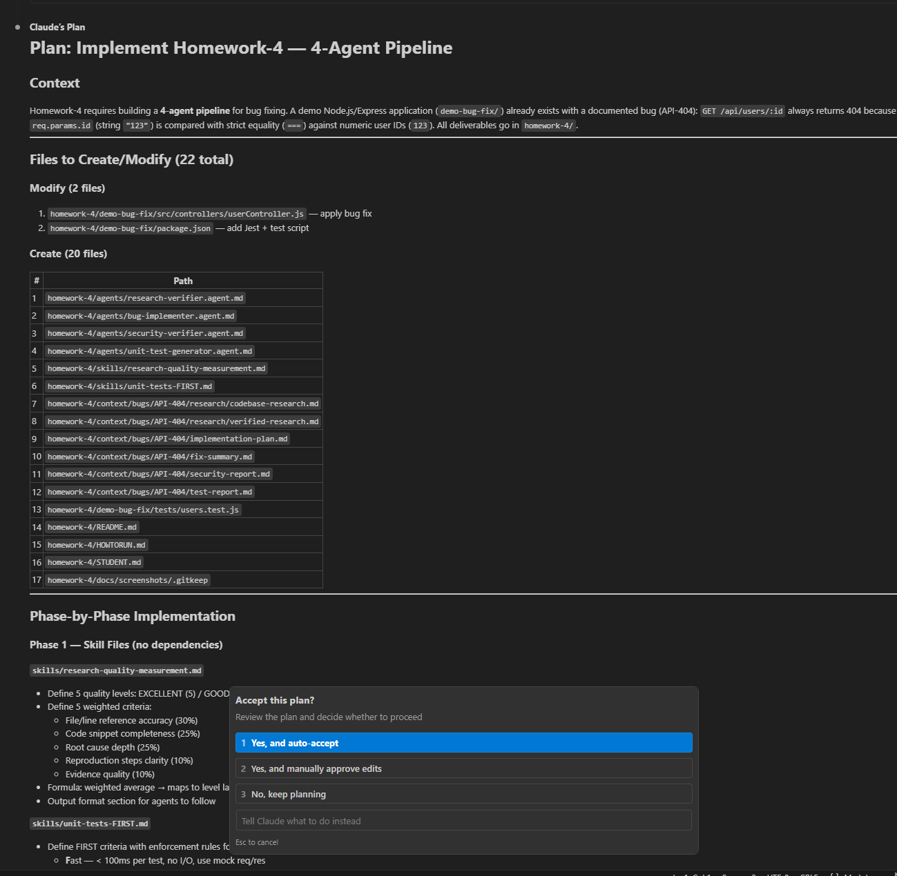
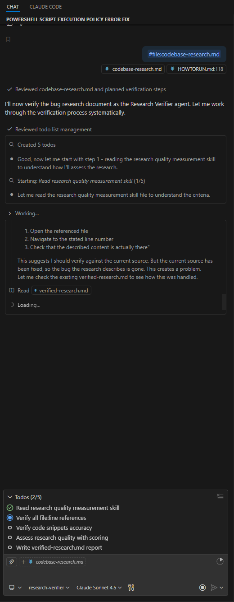

# 📝 Homework Submission - Homework 4

> **Student Name**: Mykhailo Bestiuk  
> **Date Submitted**: March 1, 2026  
> **Assignment**: Homework 4: 4-Agent Pipeline for Bug Fixing

---

## ✅ Summary

This PR submits a **4-agent pipeline** for autonomous bug fixing applied to a real Node.js/Express API bug (API-404: type mismatch in user lookup endpoint).

**Folder**: `homework-4/`

### 📦 Deliverables

| # | Deliverable | Status |
|---|------------|--------|
| 1-4 | 4 Agents (Research Verifier, Bug Implementer, Security Verifier, Unit Test Generator) | ✅ Complete |
| 5-6 | 2 Skills (Research Quality Measurement, FIRST Testing) | ✅ Complete |
| 7 | Working Application (bug fixed, 8/8 tests pass) | ✅ Complete |
| 8 | Pipeline Artifacts (6 documents in `context/bugs/API-404/`) | ✅ Complete |
| 9 | Documentation (README, HOWTORUN, STUDENT) | ✅ Complete |
| 10 | Screenshots (3 files) | ✅ Complete |

---

## 🐛 Bug Fixed: API-404

**Issue**: `GET /api/users/:id` returns 404 for all valid user IDs

**Root Cause**: JavaScript type mismatch - Express params are strings (`"123"`), users array has numeric IDs (`123`), strict equality (`===`) never matches.

**Fix**: Added `parseInt(req.params.id, 10)` on line 19 of `userController.js`

**Result**: 8/8 tests pass, endpoint now works correctly

---

## 🤖 The 4-Agent Pipeline

```
Bug Research → Research Verifier (EXCELLENT 4.7/5.0) → Bug Planner
    → Bug Implementer (SUCCESS, 8/8 tests) → Security Verifier (0 CRITICAL)
    → Unit Test Generator (8 tests, FIRST ✓)
```

### Agent Results Summary

| Agent | Output | Key Metrics |
|-------|--------|-------------|
| **Research Verifier** | `verified-research.md` | EXCELLENT (4.7/5.0), all file:line refs verified |
| **Bug Implementer** | `fix-summary.md` | SUCCESS, 1 line changed, 8/8 tests pass |
| **Security Verifier** | `security-report.md` | 0 CRITICAL, 0 HIGH, 1 MEDIUM, 1 LOW |
| **Unit Test Generator** | `test-report.md` + `tests/` | 8 tests generated, FIRST compliant, 8/8 pass |

---

## 🎯 Skills Created

### 1. Research Quality Measurement
Weighted scoring framework (5 criteria):
- File/Line Reference Accuracy (30%)
- Code Snippet Completeness (25%)
- Root Cause Depth (25%)
- Reproduction Steps Clarity (10%)
- Evidence Quality (10%)

**Quality Levels**: EXCELLENT (4.0-5.0), GOOD (3.0-3.9), ACCEPTABLE (2.0-2.9), POOR (1.0-1.9), INSUFFICIENT (0.0-0.9)

### 2. Unit Tests FIRST
Testing principles applied:
- **F**ast - Run in <300ms
- **I**ndependent - No test dependencies
- **R**epeatable - Same result every time
- **S**elf-validating - Pass/fail via assertions
- **T**imely - Written with implementation

---

## 🧪 Test Results

**Status**: ✅ 8/8 tests pass

```
PASS  tests/users.test.js
  getUserById
    ✓ returns user for valid ID 123
    ✓ returns user for valid ID 456
    ✓ returns user for valid ID 789
    ✓ returns 404 for non-existent ID 999
    ✓ returns 404 for non-numeric ID "abc"
    ✓ [REGRESSION] string "123" resolves to user (API-404 fix)
  getAllUsers
    ✓ returns all 3 users
    ✓ each user has id, name, and email

Tests: 8 passed, 8 total
Time: 0.287 s
```

---

## 🔍 Code Changes

**File**: `homework-4/demo-bug-fix/src/controllers/userController.js`

```diff
- const userId = req.params.id;
+ const userId = parseInt(req.params.id, 10);
```

**Files Created:**
- `.claude/agents/` - 4 agent definitions
- `homework-4/skills/` - 2 skill documents
- `homework-4/demo-bug-fix/tests/` - 8 unit tests
- `homework-4/context/bugs/API-404/` - 6 pipeline artifacts
- `homework-4/docs/screenshots/` - 3 screenshots
- Documentation: README, HOWTORUN, STUDENT

---

## � Screenshots

### Agent Pipeline Execution


### Test Results


### Bug Fix Verification


---

## �🛠️ AI Tools Used

- **GitHub Copilot** (Claude Sonnet 4.5) - Agent definitions, skills, tests, documentation
- **Claude Code CLI** - Installed via `npm install -g @anthropic-ai/claude-code`

---

## 💡 Key Insights

**Agent Pipeline Design:**
- Separation of concerns - each agent has one responsibility
- Skills as contracts - reproducible quality standards
- Chained verification - research → implementation → security → tests

**Results:**
- Research Quality: EXCELLENT (4.7/5.0) with all file:line refs verified
- Security: 0 critical/high findings, 2 minor findings documented
- Tests: 8/8 pass, all FIRST principles satisfied
- Fix: Single-line change resolved type mismatch bug

---

## 📊 Before vs After

| Aspect | Before | After |
|--------|--------|-------|
| Bug Status | 404 for all IDs | 200 with correct user data |
| Tests | None | 8 tests, 100% pass |
| Security | Not reviewed | Reviewed, 0 critical issues |
| Documentation | Bug report only | Full pipeline artifacts |

---

## 🚀 How to Run

```bash
cd homework-4/demo-bug-fix
npm install
npm test          # 8/8 tests pass
npm start         # Start server
curl http://localhost:3000/api/users/123  # Test endpoint
```

See [homework-4/HOWTORUN.md](homework-4/HOWTORUN.md) for detailed instructions.

---

**Ready for review!** 🚀

---

**Ready for review!** 🚀

