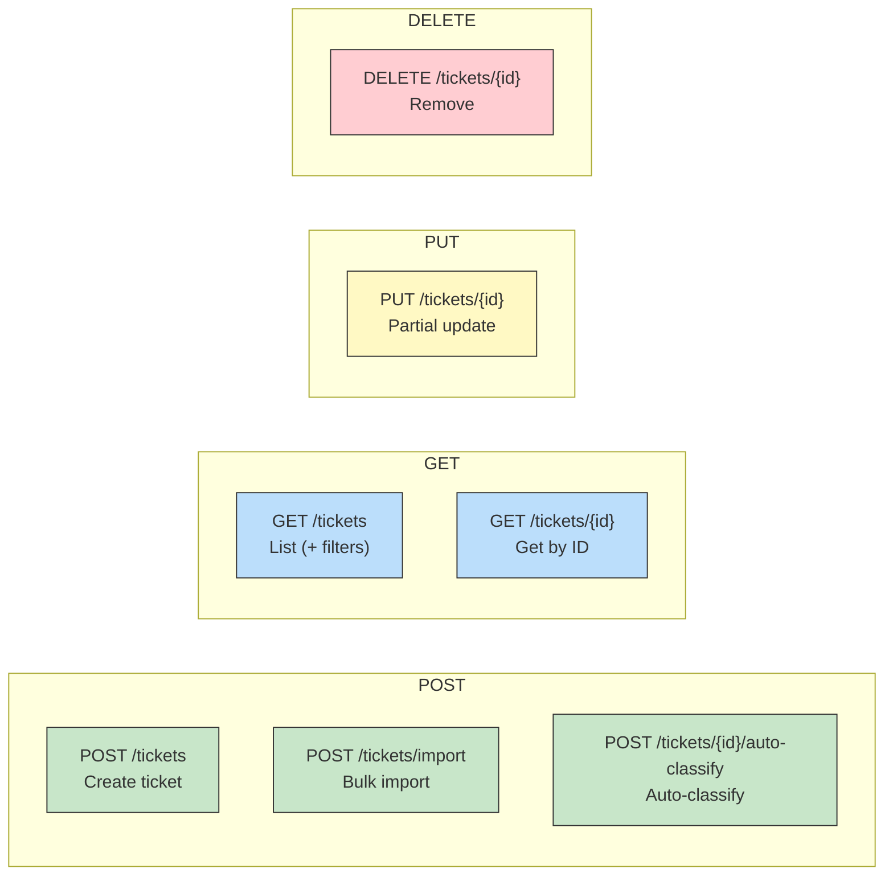

# API Reference

Complete REST API documentation for the Customer Support System (CSS).

**Base URL:** `http://localhost:8080`  
**Content-Type:** `application/json` (unless uploading files)  
**Naming Convention:** All JSON fields use `snake_case`

---

## Endpoint Overview



---

## Table of Contents

- [Data Models](#data-models)
- [Endpoints](#endpoints)
  - [Create Ticket](#create-ticket)
  - [Bulk Import](#bulk-import)
  - [List Tickets](#list-tickets)
  - [Get Ticket](#get-ticket)
  - [Update Ticket](#update-ticket)
  - [Delete Ticket](#delete-ticket)
  - [Auto-Classify Ticket](#auto-classify-ticket)
- [Error Responses](#error-responses)

---

## Data Models

### Ticket

| Field | Type | Description |
|-------|------|-------------|
| `id` | `UUID` | Auto-generated unique identifier |
| `customer_id` | `string` | **Required.** Customer identifier |
| `customer_email` | `string` | **Required.** Valid email address |
| `customer_name` | `string` | **Required.** Customer full name |
| `subject` | `string` | **Required.** 1–200 characters |
| `description` | `string` | **Required.** 10–2000 characters |
| `category` | `enum` | One of: `account_access`, `technical_issue`, `billing_question`, `feature_request`, `bug_report`, `other` |
| `priority` | `enum` | One of: `urgent`, `high`, `medium`, `low` |
| `status` | `enum` | One of: `new`, `in_progress`, `waiting_customer`, `resolved`, `closed` |
| `created_at` | `datetime` | ISO-8601 timestamp (auto-set) |
| `updated_at` | `datetime` | ISO-8601 timestamp (auto-updated) |
| `resolved_at` | `datetime?` | Set when status → `resolved` or `closed` |
| `assigned_to` | `string?` | Agent assigned to the ticket |
| `tags` | `string[]` | List of tags |
| `metadata` | `object` | See [Metadata](#metadata) |
| `classification_confidence` | `number?` | 0.0–1.0 confidence score |
| `classification_reasoning` | `string?` | Human-readable explanation |
| `classification_keywords` | `string[]` | Keywords that triggered classification |

### Metadata

| Field | Type | Values |
|-------|------|--------|
| `source` | `enum` | `web_form`, `email`, `api`, `chat`, `phone` |
| `browser` | `string` | Browser user-agent string |
| `device_type` | `enum` | `desktop`, `mobile`, `tablet` |

### Import Result

| Field | Type | Description |
|-------|------|-------------|
| `total_records` | `int` | Total records in the file |
| `successful_records` | `int` | Successfully imported count |
| `failed_records` | `int` | Failed record count |
| `errors` | `ImportError[]` | Details of each failure |
| `imported_ticket_ids` | `string[]` | IDs of successfully imported tickets |

### Import Error

| Field | Type | Description |
|-------|------|-------------|
| `record_number` | `int` | 1-based record index |
| `field` | `string` | Field that failed validation |
| `message` | `string` | Human-readable error message |
| `raw_data` | `string` | The raw input that caused the error |

### Classification Result

| Field | Type | Description |
|-------|------|-------------|
| `category` | `enum` | Assigned category |
| `priority` | `enum` | Assigned priority |
| `confidence` | `number` | 0.0–1.0 confidence score |
| `reasoning` | `string` | Explanation of the decision |
| `keywords` | `string[]` | Keywords found in the ticket |

---

## Endpoints

### Create Ticket

Create a new support ticket.

```
POST /tickets
```

**Request Body:**

| Field | Required | Notes |
|-------|----------|-------|
| `customer_id` | Yes | |
| `customer_email` | Yes | Must be valid email format |
| `customer_name` | Yes | |
| `subject` | Yes | 1–200 characters |
| `description` | Yes | 10–2000 characters |
| `category` | No | Defaults to `other` |
| `priority` | No | Defaults to `medium` |
| `tags` | No | Array of strings |
| `metadata` | No | `source`, `browser`, `device_type` |
| `auto_classify` | No | `true` to auto-classify on creation |

**cURL Example:**

```bash
curl -X POST http://localhost:8080/tickets \
  -H "Content-Type: application/json" \
  -d '{
    "customer_id": "CUST001",
    "customer_email": "jane.doe@example.com",
    "customer_name": "Jane Doe",
    "subject": "Cannot log in to my account",
    "description": "I have been unable to access my account since yesterday. I tried resetting my password but the reset email never arrives.",
    "category": "account_access",
    "priority": "high",
    "tags": ["login", "password-reset"],
    "metadata": {
      "source": "web_form",
      "browser": "Chrome 120",
      "device_type": "desktop"
    },
    "auto_classify": false
  }'
```

**Response:** `201 Created`

```json
{
  "id": "a1b2c3d4-e5f6-7890-abcd-ef1234567890",
  "customer_id": "CUST001",
  "customer_email": "jane.doe@example.com",
  "customer_name": "Jane Doe",
  "subject": "Cannot log in to my account",
  "description": "I have been unable to access my account since yesterday. I tried resetting my password but the reset email never arrives.",
  "category": "account_access",
  "priority": "high",
  "status": "new",
  "created_at": "2026-02-28T10:30:00",
  "updated_at": "2026-02-28T10:30:00",
  "resolved_at": null,
  "assigned_to": null,
  "tags": ["login", "password-reset"],
  "metadata": {
    "source": "web_form",
    "browser": "Chrome 120",
    "device_type": "desktop"
  },
  "classification_confidence": null,
  "classification_reasoning": null,
  "classification_keywords": []
}
```

---

### Bulk Import

Import tickets from a CSV, JSON, or XML file.

```
POST /tickets/import
```

**Content-Type:** `multipart/form-data`  
**Parameter:** `file` — the file to upload (`.csv`, `.json`, or `.xml`)

**cURL Examples:**

```bash
# Import from CSV
curl -X POST http://localhost:8080/tickets/import \
  -F "file=@src/main/resources/sample-data/sample_tickets.csv"

# Import from JSON
curl -X POST http://localhost:8080/tickets/import \
  -F "file=@src/main/resources/sample-data/sample_tickets.json"

# Import from XML
curl -X POST http://localhost:8080/tickets/import \
  -F "file=@src/main/resources/sample-data/sample_tickets.xml"
```

**Response:** `200 OK`

```json
{
  "total_records": 20,
  "successful_records": 18,
  "failed_records": 2,
  "errors": [
    {
      "record_number": 5,
      "field": "customer_email",
      "message": "Invalid email format",
      "raw_data": "not-an-email"
    },
    {
      "record_number": 12,
      "field": "description",
      "message": "Description must be between 10 and 2000 characters",
      "raw_data": "Short"
    }
  ],
  "imported_ticket_ids": [
    "a1b2c3d4-...",
    "b2c3d4e5-..."
  ]
}
```

**Supported Formats:**

| Format | File Extension | Structure |
|--------|---------------|-----------|
| CSV | `.csv` | Headers in first row, pipe-delimited tags |
| JSON | `.json` | Array of ticket objects |
| XML | `.xml` | `<tickets><ticket>...</ticket></tickets>` |

---

### List Tickets

Retrieve all tickets with optional filtering.

```
GET /tickets
```

**Query Parameters (all optional):**

| Parameter | Type | Example |
|-----------|------|---------|
| `category` | enum | `?category=billing_question` |
| `priority` | enum | `?priority=urgent` |
| `status` | enum | `?status=new` |
| `customerId` | string | `?customerId=CUST001` |

Filters can be combined: `?category=bug_report&priority=high&status=new`

**cURL Examples:**

```bash
# Get all tickets
curl http://localhost:8080/tickets

# Filter by category
curl "http://localhost:8080/tickets?category=technical_issue"

# Combined filters
curl "http://localhost:8080/tickets?category=billing_question&priority=urgent&status=new"

# Filter by customer
curl "http://localhost:8080/tickets?customerId=CUST001"
```

**Response:** `200 OK`

```json
[
  {
    "id": "a1b2c3d4-e5f6-7890-abcd-ef1234567890",
    "customer_id": "CUST001",
    "customer_email": "jane.doe@example.com",
    "customer_name": "Jane Doe",
    "subject": "Cannot log in to my account",
    "description": "...",
    "category": "account_access",
    "priority": "high",
    "status": "new",
    "created_at": "2026-02-28T10:30:00",
    "updated_at": "2026-02-28T10:30:00",
    "resolved_at": null,
    "assigned_to": null,
    "tags": ["login"],
    "metadata": null,
    "classification_confidence": null,
    "classification_reasoning": null,
    "classification_keywords": []
  }
]
```

---

### Get Ticket

Retrieve a specific ticket by ID.

```
GET /tickets/{id}
```

**cURL Example:**

```bash
curl http://localhost:8080/tickets/a1b2c3d4-e5f6-7890-abcd-ef1234567890
```

**Response:** `200 OK` — Returns a single Ticket object (same schema as above).

**Error:** `404 Not Found` if the ticket ID does not exist.

---

### Update Ticket

Update an existing ticket. Only non-null fields in the request body are applied (partial update).

```
PUT /tickets/{id}
```

**Request Body (all fields optional):**

| Field | Notes |
|-------|-------|
| `customer_id` | |
| `customer_email` | Must be valid email if provided |
| `customer_name` | |
| `subject` | 1–200 characters if provided |
| `description` | 10–2000 characters if provided |
| `category` | |
| `priority` | |
| `status` | Setting to `resolved`/`closed` auto-sets `resolved_at` |
| `assigned_to` | |
| `tags` | Replaces existing tags |
| `metadata` | |

**cURL Example:**

```bash
curl -X PUT http://localhost:8080/tickets/a1b2c3d4-e5f6-7890-abcd-ef1234567890 \
  -H "Content-Type: application/json" \
  -d '{
    "status": "in_progress",
    "assigned_to": "agent-smith",
    "priority": "urgent"
  }'
```

**Response:** `200 OK` — Returns the updated Ticket object.

**Error:** `404 Not Found` if the ticket ID does not exist.

---

### Delete Ticket

Delete a ticket by ID.

```
DELETE /tickets/{id}
```

**cURL Example:**

```bash
curl -X DELETE http://localhost:8080/tickets/a1b2c3d4-e5f6-7890-abcd-ef1234567890
```

**Response:** `204 No Content`

**Error:** `404 Not Found` if the ticket ID does not exist.

---

### Auto-Classify Ticket

Run automatic classification on an existing ticket. Updates the ticket's `category`, `priority`, `classification_confidence`, `classification_reasoning`, and `classification_keywords` fields.

```
POST /tickets/{id}/auto-classify
```

**cURL Example:**

```bash
curl -X POST http://localhost:8080/tickets/a1b2c3d4-e5f6-7890-abcd-ef1234567890/auto-classify
```

**Response:** `200 OK`

```json
{
  "category": "account_access",
  "priority": "urgent",
  "confidence": 0.67,
  "reasoning": "Matched keywords: [login, password, access]. Classified as account_access with priority urgent (confidence: 0.67)",
  "keywords": ["login", "password", "access"]
}
```

**Classification Keywords by Category:**

| Category | Keywords |
|----------|----------|
| `account_access` | login, password, access, account, locked, 2fa, authentication, sign in, credentials |
| `technical_issue` | error, bug, crash, not working, broken, issue, problem, fail, glitch |
| `billing_question` | billing, invoice, payment, charge, refund, subscription, price, cost |
| `feature_request` | feature, request, enhancement, suggestion, improve, add, wishlist |
| `bug_report` | bug, defect, reproduce, steps, expected, actual, regression |

**Priority Keywords:**

| Priority | Keywords |
|----------|----------|
| `urgent` | can't access, critical, production down, security, emergency, outage |
| `high` | important, blocking, asap, urgent, severe |
| `low` | minor, cosmetic, suggestion, nice to have, low priority |
| `medium` | Default when no priority keywords match |

---

## Error Responses

All errors follow a consistent format:

```json
{
  "status": 400,
  "error": "Bad Request",
  "message": "Validation failed",
  "timestamp": 1740700000000,
  "field_errors": {
    "customer_email": "Invalid email format",
    "description": "Description must be between 10 and 2000 characters"
  }
}
```

### HTTP Status Codes

| Code | Meaning | When |
|------|---------|------|
| `200` | OK | Successful GET, PUT, POST (classify/import) |
| `201` | Created | Ticket successfully created |
| `204` | No Content | Ticket successfully deleted |
| `400` | Bad Request | Validation error, malformed import file, invalid arguments |
| `404` | Not Found | Ticket ID does not exist |
| `500` | Internal Server Error | Unexpected server failure |

### Exception Types

| Exception | HTTP Code | Description |
|-----------|-----------|-------------|
| `ValidationException` | 400 | Field validation failed — includes `field_errors` map |
| `ImportException` | 400 | Import file parsing or processing error |
| `IllegalArgumentException` | 400 | Invalid enum value or argument |
| `TicketNotFoundException` | 404 | Ticket with given UUID not found |
