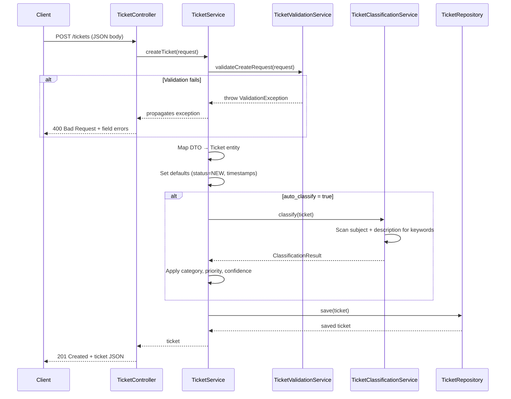
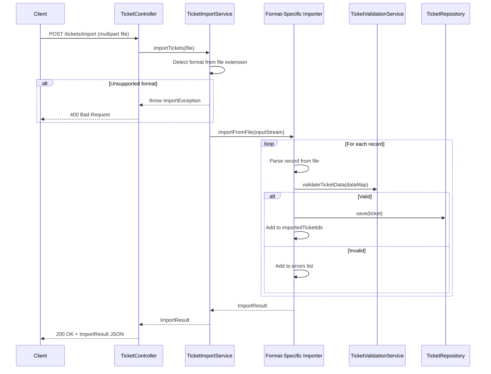

# Architecture Document

Technical architecture overview of the Customer Support System (CSS) for technical leads and system architects.

---

## Table of Contents

- [High-Level Architecture](#high-level-architecture)
- [Component Descriptions](#component-descriptions)
- [Data Flow Diagrams](#data-flow-diagrams)
- [Design Decisions and Trade-offs](#design-decisions-and-trade-offs)

---

## High-Level Architecture

The system follows a classic **layered architecture** with clear separation of concerns across Controller, Service, and Repository layers. All components are managed by Spring's IoC container.

```mermaid
graph TB
    subgraph Presentation Layer
        TC[TicketController<br/><i>@RestController</i>]
    end

    subgraph Service Layer
        TS[TicketService]
        TVS[TicketValidationService]
        TCS[TicketClassificationService]
        TIS[TicketImportService]
    end

    subgraph Import Subsystem
        CSV[CsvImportService]
        JSON[JsonImportService]
        XML[XmlImportService]
    end

    subgraph Data Layer
        TR[TicketRepository]
        STORE[(ConcurrentHashMap<br/>In-Memory Store)]
    end

    subgraph Cross-Cutting
        GEH[GlobalExceptionHandler<br/><i>@ControllerAdvice</i>]
        JC[JacksonConfig<br/><i>snake_case + JSR-310</i>]
    end

    TC --> TS
    TC --> TIS
    TC --> TCS
    TS --> TVS
    TS --> TCS
    TS --> TR
    TIS --> CSV
    TIS --> JSON
    TIS --> XML
    CSV --> TVS
    JSON --> TVS
    XML --> TVS
    CSV --> TR
    JSON --> TR
    XML --> TR
    TR --> STORE
    GEH -.->|intercepts| TC
    JC -.->|configures| TC
```

---

## Component Descriptions

### Presentation Layer

| Component | Responsibility |
|-----------|----------------|
| **TicketController** | Exposes 7 REST endpoints under `/tickets`. Handles request/response mapping, delegates all business logic to services. Stateless. |
| **GlobalExceptionHandler** | `@ControllerAdvice` that intercepts exceptions and maps them to consistent `ErrorResponse` DTOs with appropriate HTTP status codes (400, 404, 500). |
| **JacksonConfig** | Configures Jackson `ObjectMapper` with `snake_case` naming strategy and `JavaTimeModule` for `LocalDateTime` serialization. Also sets default content type to `application/json`. |

### Service Layer

| Component | Responsibility |
|-----------|----------------|
| **TicketService** | Core business logic: create, read, update, delete tickets. Orchestrates validation and optional auto-classification during creation. Manages `resolved_at` timestamps on status transitions. |
| **TicketValidationService** | Validates all required fields: email format (regex), string lengths (subject 1–200, description 10–2000), and required fields. Provides separate methods for create requests, update requests (partial), and raw data maps (for importers). |
| **TicketClassificationService** | Keyword-based classification engine. Scans ticket `subject` + `description` for category/priority keywords. Produces a `ClassificationResult` with category, priority, confidence (0–1), reasoning, and matched keywords. |
| **TicketImportService** | Routes uploaded files to format-specific importers based on file extension. Validates filename presence and supported formats (`.csv`, `.json`, `.xml`). |

### Import Subsystem

| Component | Responsibility |
|-----------|----------------|
| **CsvImportService** | Parses CSV files with a custom line parser supporting quoted fields and escape characters. Maps header columns to ticket fields, validates each row, saves valid tickets, and tracks failures with detailed error information. |
| **JsonImportService** | Deserializes JSON arrays using Jackson `ObjectMapper` (lenient, snake_case). Uses inner `JsonTicketData` class for mapping. Falls back to defaults for unknown enum values. |
| **XmlImportService** | Parses XML using DOM parser with **XXE protection** (external entities disabled). Processes `<ticket>` elements, handles nested `<tags>` and `<metadata>` structures. |

### Data Layer

| Component | Responsibility |
|-----------|----------------|
| **TicketRepository** | In-memory store using `ConcurrentHashMap<UUID, Ticket>`. Provides CRUD operations and stream-based filtering by category, priority, status, and customer ID. Thread-safe for concurrent access. |

### Domain Model

| Component | Description |
|-----------|-------------|
| **Ticket** | Core entity with UUID, customer info, subject/description, category, priority, status, timestamps, tags, metadata, and classification fields. |
| **TicketMetadata** | Value object: source channel, browser, device type. |
| **Enums** | `TicketCategory` (6 values), `TicketPriority` (4), `TicketStatus` (5), `TicketSource` (5), `DeviceType` (3). All use `@JsonValue`/`@JsonCreator` for snake_case serialization with case-insensitive parsing. |

### DTOs

| Component | Purpose |
|-----------|---------|
| **CreateTicketRequest** | Inbound DTO for ticket creation. Includes optional `auto_classify` flag and nested `MetadataRequest`. |
| **UpdateTicketRequest** | Inbound DTO for partial updates. Null fields are skipped during update. |
| **ImportResult** | Outbound DTO for import operations: success/failure counts, error details, imported IDs. |
| **ErrorResponse** | Outbound DTO for all error responses: status, message, timestamp, optional field errors map. |
| **ClassificationResult** | Outbound DTO for classification: category, priority, confidence, reasoning, keywords. |

---

## Data Flow Diagrams

### Ticket Creation Flow



### Bulk Import Flow



---

## Design Decisions and Trade-offs

### 1. In-Memory Storage (ConcurrentHashMap)

**Decision:** Use `ConcurrentHashMap` instead of a database.

| Pros | Cons |
|------|------|
| Zero infrastructure dependencies | Data lost on restart |
| Sub-millisecond read/write | No persistence guarantee |
| Simple deployment (single JAR) | Limited query capabilities (no SQL) |
| Thread-safe by default | Memory-bound capacity |

**Rationale:** For a homework/prototype, this eliminates database setup complexity while demonstrating proper repository patterns that can be swapped for JPA/JDBC later.

### 2. Keyword-Based Classification (vs. ML)

**Decision:** Use static keyword dictionaries instead of machine learning.

| Pros | Cons |
|------|------|
| Deterministic and testable | Limited accuracy for ambiguous text |
| No model training needed | Requires manual keyword maintenance |
| Fast execution (O(n) string scan) | No learning from feedback |
| Easy to extend | Cannot handle misspellings |

**Rationale:** Keyword-based classification provides predictable, debuggable behavior suitable for demonstration. The confidence score (matched keywords / 3.0, capped at 1.0) provides a transparent metric.

### 3. Layered Architecture

**Decision:** Strict Controller → Service → Repository separation.

**Rationale:** Enables independent unit testing of each layer with mocks. Services are reusable across different entry points. Controllers remain thin and only handle HTTP concerns.

### 4. Strategy Pattern for Importers

**Decision:** `TicketImportService` routes to format-specific importers based on file extension.

**Rationale:** Adding a new format (e.g., YAML) only requires a new importer class and a case in the router. Existing importers remain untouched (Open/Closed Principle).

### 5. Partial Updates (PUT)

**Decision:** `PUT /tickets/{id}` applies only non-null fields from the request body.

**Rationale:** Avoids requiring clients to send the full ticket on every update. Simplifies the API for common operations like status changes or reassignment. Note: this is more PATCH-like semantics on a PUT endpoint — a pragmatic trade-off for simplicity.

### 6. snake_case JSON Convention

**Decision:** Global Jackson configuration with `PropertyNamingStrategies.SNAKE_CASE`.

**Rationale:** Aligns with the ticket model specification and common REST API conventions. Applied globally via `JacksonConfig` so all endpoints are consistent without per-field annotations.
