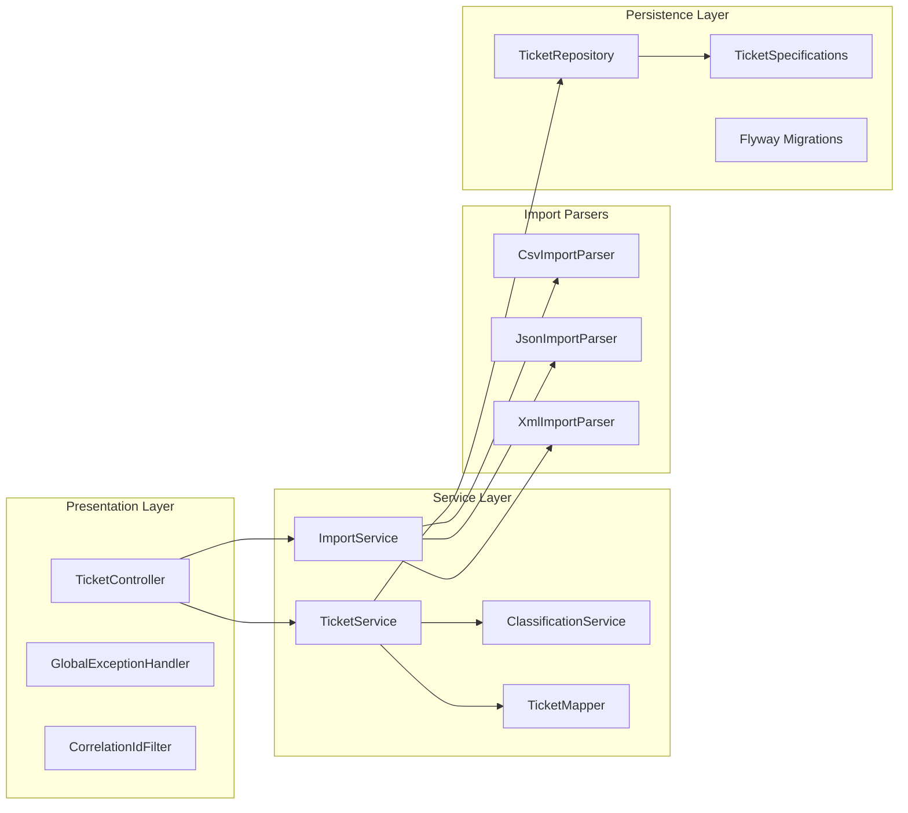
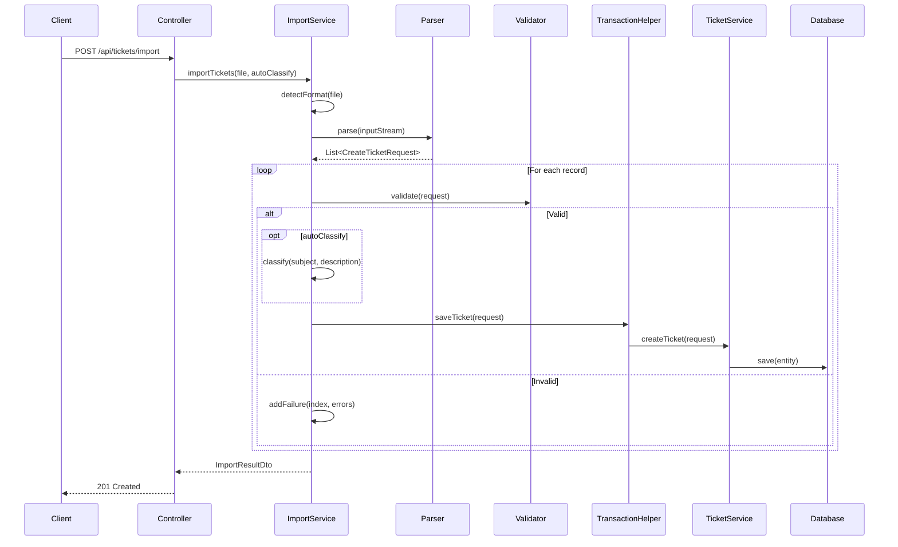

# SupportIQ Ticket System -- Architecture

## System Overview

The SupportIQ Ticket System is a Spring Boot REST API for managing customer-support tickets. It follows a **layered architecture** with clear separation of concerns across four tiers:

| Layer | Responsibility |
|---|---|
| **Presentation** | HTTP handling, request validation, error translation, correlation-ID propagation |
| **Service** | Business logic, classification, bulk-import orchestration, entity mapping |
| **Import Parsers** | Format-specific deserialization (CSV, JSON, XML) into a common request DTO |
| **Persistence** | JPA repositories, dynamic query specifications, Flyway-managed schema migrations |

Requests flow top-down through these layers. Each layer depends only on the layer directly below it, keeping coupling low and making individual components easy to test or replace.

---

## Component Diagram

**CorrelationIdFilter** runs as a servlet filter (`@Order(1)`) that reads or generates an `X-Correlation-ID` header and places it into the SLF4J MDC so that every log line within a request can be traced back to the originating call.

**GlobalExceptionHandler** translates domain exceptions (`TicketNotFoundException`, `UnsupportedImportFormatException`, validation failures) into consistent JSON error responses with the correlation ID attached.

**TicketController** is the single REST controller. It delegates CRUD and classification operations to `TicketService` and file-import operations to `ImportService`.

---

## Import Flow Sequence Diagram

### How it works

1. The client uploads a file to `POST /api/tickets/import` with an optional `autoClassify` flag.
2. `ImportService.detectFormat` resolves the parser by file extension or content type.
3. The chosen parser (CSV, JSON, or XML) deserializes the stream into a list of `CreateTicketRequest` DTOs.
4. Each record is validated with the Jakarta Bean Validation API. Invalid records are collected as `ImportFailureDto` entries (containing the record index and error messages) and are **not** persisted.
5. Valid records are optionally auto-classified by `ClassificationService`, then persisted through `ImportTransactionHelper`, which wraps every single save in its own `REQUIRES_NEW` transaction.
6. The response is an `ImportResultDto` summarizing totals, created tickets, and failures.

---

## Key Design Decisions

### Keyword-based classification

`ClassificationService` uses static keyword maps to assign a `TicketCategory` and `TicketPriority`. The text of the subject and description is scanned against each category's keyword list; the category with the most matches wins. Priority keywords are checked in precedence order (URGENT > HIGH > LOW), defaulting to MEDIUM.

**Why:** This approach is simple, deterministic, and has zero external dependencies. It needs no model training, no API calls, and no GPU. The confidence score (0.3 base + 0.1 per matched keyword, capped at 1.0) and the reasoning string make results transparent and debuggable. It can be swapped for an ML-based classifier later without changing the service interface.

### Per-record transaction isolation for imports

`ImportTransactionHelper.saveTicket` is annotated with `@Transactional(propagation = Propagation.REQUIRES_NEW)`. This means each record in a bulk import commits or rolls back independently.

**Why:** A single bad record should not prevent the remaining records from being saved. The caller collects failures into `ImportFailureDto` and returns a complete summary so the client knows exactly which records succeeded and which did not.

### JPA Specifications for dynamic filtering

`TicketSpecifications` provides composable, null-safe `Specification<TicketEntity>` predicates for category, priority, status, customer email, creation date range, and tags. `TicketService.listTickets` chains them with `Specification.where(...).and(...)`.

**Why:** Specifications avoid the combinatorial explosion of custom repository methods that would be needed to support every filter combination. Adding a new filter is a one-method change. They also keep query logic out of the controller.

### Snake-case JSON serialization

`JacksonConfig` sets `PropertyNamingStrategies.SNAKE_CASE` globally, and the same strategy is declared in `application.yml`. All JSON request and response bodies use `snake_case` field names (e.g., `customer_email`, `created_at`).

**Why:** Snake case is the dominant convention in REST APIs consumed by front-end and scripting clients. Configuring it globally avoids per-field `@JsonProperty` annotations and keeps DTOs clean.

### H2 for testing, PostgreSQL for production

Production targets PostgreSQL (configured in `application.yml`). The test profile (`application-test.yml`) can use H2 for fast, zero-setup unit and integration tests. A `TestcontainersConfig` class is available for tests that need real PostgreSQL behavior (dialect-specific queries, sequence generation, etc.).

**Why:** H2 gives fast feedback during development and CI. Testcontainers provides a safety net for catching database-dialect differences before deployment.

---

## Trade-offs

| Decision | Benefit | Cost |
|---|---|---|
| Keyword classification over ML | Zero infrastructure, deterministic, fast, easy to debug | Lower accuracy on ambiguous or novel phrasing; no learning from historical data |
| Per-record transactions | Partial-success imports; one bad record does not block the rest | Higher connection/transaction overhead on large files; no all-or-nothing rollback option |
| JPA Specifications | Composable, type-safe, easy to extend | Slightly more verbose than JPQL for simple queries; requires familiarity with the Criteria API |
| Snake-case JSON globally | Consistent API surface; no per-field annotations | Java code uses camelCase internally, so the mapping is invisible -- can surprise developers unfamiliar with the config |
| Flyway migrations | Versioned, repeatable schema changes; safe for team collaboration | Schema changes require a new migration file rather than ad-hoc DDL |
| Correlation-ID filter | End-to-end request tracing across logs | Adds a filter to the servlet chain; clients must propagate the header for full tracing benefit |
| H2 for tests / Testcontainers for PostgreSQL | Fast default tests with an escape hatch for dialect-specific testing | H2 may mask PostgreSQL-only behaviors if Testcontainers tests are not run regularly |
