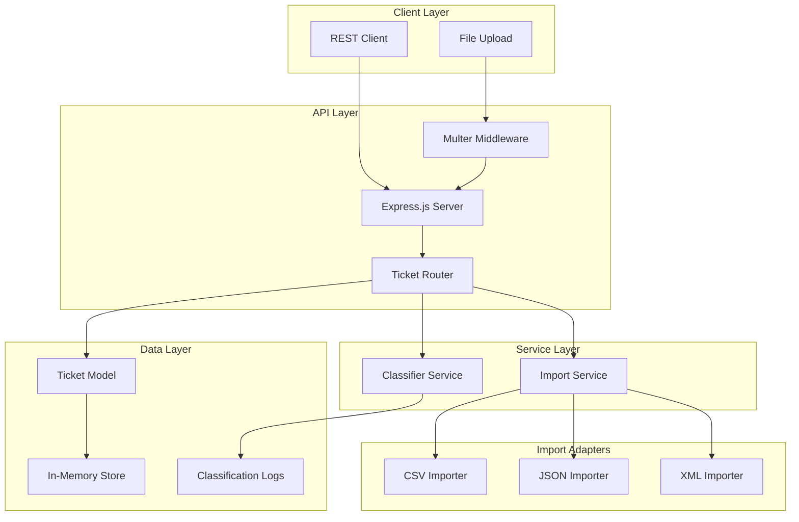
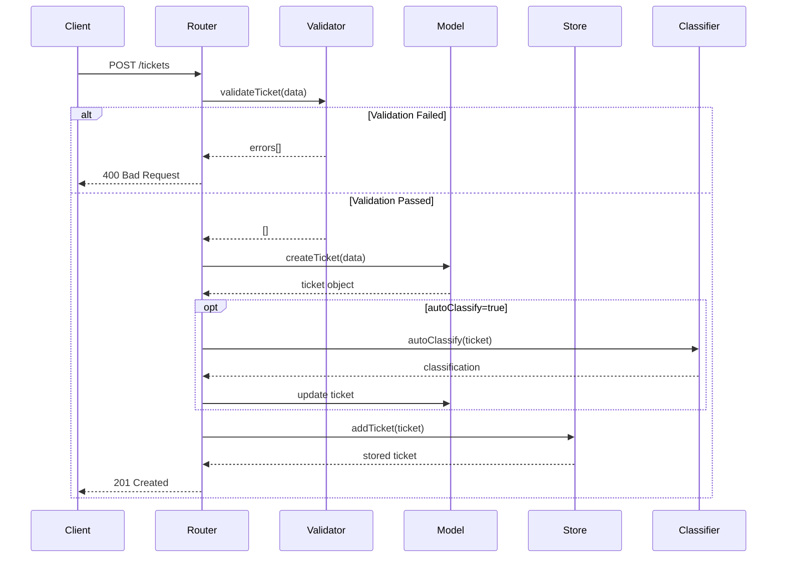
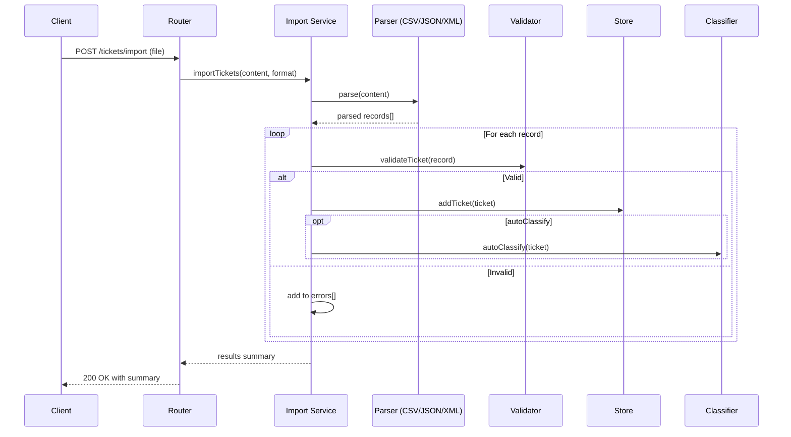
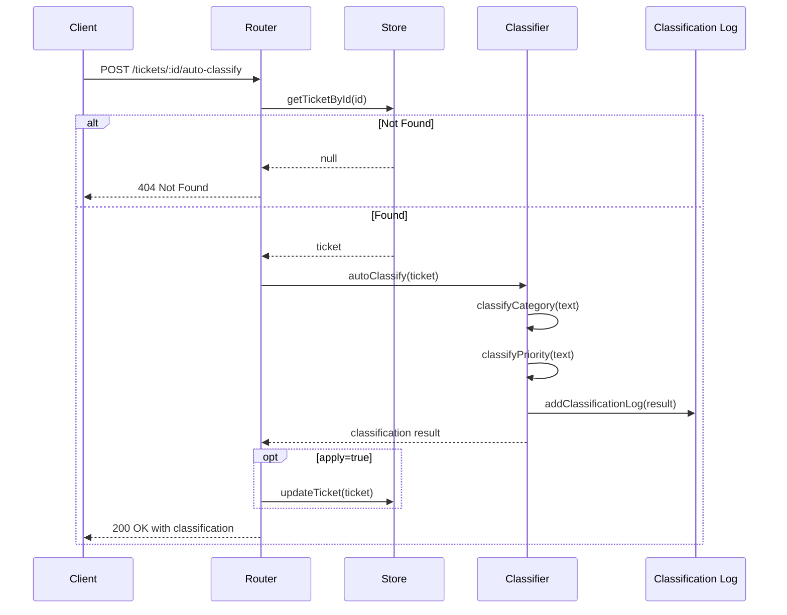

# Architecture Documentation

Technical architecture documentation for the Customer Support Ticket System.

---

## High-Level Architecture

```mermaid
graph TB
    subgraph "Client Layer"
        A[REST Client]
        B[File Upload]
    end

    subgraph "API Layer"
        C[Express.js Server]
        D[Ticket Router]
        E[Multer Middleware]
    end

    subgraph "Service Layer"
        F[Classifier Service]
        G[Import Service]
    end

    subgraph "Import Adapters"
        H[CSV Importer]
        I[JSON Importer]
        J[XML Importer]
    end

    subgraph "Data Layer"
        K[Ticket Model]
        L[In-Memory Store]
        M[Classification Logs]
    end

    A --> C
    B --> E --> C
    C --> D
    D --> F
    D --> G
    G --> H
    G --> I
    G --> J
    D --> K
    K --> L
    F --> M
```

---

## Component Descriptions

### API Layer

| Component | File | Description |
|-----------|------|-------------|
| Express Server | `src/index.js` | HTTP server, middleware setup, route mounting |
| Ticket Router | `src/routes/tickets.js` | All ticket-related endpoints and request handling |
| Multer Middleware | (integrated) | File upload handling for bulk import |

### Service Layer

| Component | File | Description |
|-----------|------|-------------|
| Classifier Service | `src/services/classifier.js` | Keyword-based category and priority classification |
| Import Service | `src/services/importers/index.js` | Orchestrates file parsing and ticket creation |

### Import Adapters

| Component | File | Description |
|-----------|------|-------------|
| CSV Importer | `src/services/importers/csvImporter.js` | Parses CSV using csv-parse library |
| JSON Importer | `src/services/importers/jsonImporter.js` | Parses JSON array or object with tickets |
| XML Importer | `src/services/importers/xmlImporter.js` | Parses XML using xml2js library |

### Data Layer

| Component | File | Description |
|-----------|------|-------------|
| Ticket Model | `src/models/ticket.js` | Data validation, creation, and updates |
| In-Memory Store | `src/data/store.js` | Map-based ticket storage with filtering |

---

## Data Flow Diagrams

### Ticket Creation Flow

```mermaid
sequenceDiagram
    participant C as Client
    participant R as Router
    participant V as Validator
    participant M as Model
    participant S as Store
    participant CL as Classifier

    C->>R: POST /tickets
    R->>V: validateTicket(data)
    alt Validation Failed
        V-->>R: errors[]
        R-->>C: 400 Bad Request
    else Validation Passed
        V-->>R: []
        R->>M: createTicket(data)
        M-->>R: ticket object
        opt autoClassify=true
            R->>CL: autoClassify(ticket)
            CL-->>R: classification
            R->>M: update ticket
        end
        R->>S: addTicket(ticket)
        S-->>R: stored ticket
        R-->>C: 201 Created
    end
```

### Bulk Import Flow

```mermaid
sequenceDiagram
    participant C as Client
    participant R as Router
    participant I as Import Service
    participant P as Parser (CSV/JSON/XML)
    participant V as Validator
    participant S as Store
    participant CL as Classifier

    C->>R: POST /tickets/import (file)
    R->>I: importTickets(content, format)
    I->>P: parse(content)
    P-->>I: parsed records[]

    loop For each record
        I->>V: validateTicket(record)
        alt Valid
            I->>S: addTicket(ticket)
            opt autoClassify
                I->>CL: autoClassify(ticket)
            end
        else Invalid
            I->>I: add to errors[]
        end
    end

    I-->>R: results summary
    R-->>C: 200 OK with summary
```

### Auto-Classification Flow

```mermaid
sequenceDiagram
    participant C as Client
    participant R as Router
    participant S as Store
    participant CL as Classifier
    participant L as Classification Log

    C->>R: POST /tickets/:id/auto-classify
    R->>S: getTicketById(id)
    alt Not Found
        S-->>R: null
        R-->>C: 404 Not Found
    else Found
        S-->>R: ticket
        R->>CL: autoClassify(ticket)
        CL->>CL: classifyCategory(text)
        CL->>CL: classifyPriority(text)
        CL->>L: addClassificationLog(result)
        CL-->>R: classification result
        opt apply=true
            R->>S: updateTicket(ticket)
        end
        R-->>C: 200 OK with classification
    end
```

---

## Design Decisions

### 1. In-Memory Storage

**Decision**: Use JavaScript Map for ticket storage instead of a database.

**Rationale**:
- Simplicity for homework assignment
- Fast read/write operations
- No external dependencies
- Easy to reset for testing

**Trade-offs**:
- Data not persisted between restarts
- Not suitable for production with large datasets
- No concurrent access controls

### 2. Keyword-Based Classification

**Decision**: Use keyword matching instead of ML-based classification.

**Rationale**:
- Deterministic and explainable results
- No training data required
- Fast execution
- Easy to extend with new keywords

**Trade-offs**:
- Less accurate than ML approaches
- Requires manual keyword maintenance
- May miss context and sentiment

### 3. Multi-Format Import Strategy

**Decision**: Use adapter pattern for different file formats.

**Rationale**:
- Separation of concerns
- Easy to add new formats
- Common interface for all importers
- Independent testing of each parser

### 4. Confidence Scoring

**Decision**: Include confidence scores (0-1) with classifications.

**Rationale**:
- Allows clients to set thresholds
- Transparency in classification decisions
- Supports manual override decisions
- Enables quality monitoring

---

## Security Considerations

| Concern | Mitigation |
|---------|------------|
| File Upload Size | Multer configured with 10MB limit |
| Input Validation | All fields validated before processing |
| Injection Attacks | No direct SQL/NoSQL, data sanitized |
| DoS via Large Files | File size limits enforced |

---

## Performance Considerations

### Benchmarks

| Operation | Target | Actual |
|-----------|--------|--------|
| Create 100 tickets | <2s | ~1s |
| Retrieve 1000 tickets | <500ms | ~100ms |
| Classify 100 tickets | <100ms | ~50ms |
| Filter 500 tickets | <100ms | ~20ms |

### Optimizations Applied

1. **Map-based storage**: O(1) lookups by ID
2. **In-memory processing**: No I/O latency
3. **Sync classification**: Single-threaded keyword matching
4. **Array filtering**: Built-in optimized methods

---

## Extensibility Points

### Adding New File Format

1. Create new importer in `src/services/importers/`
2. Implement `parse(content)` function returning `[{rowNumber, data}]`
3. Add format case in `importTickets()` switch statement
4. Add corresponding tests

### Adding New Category

1. Add to `CATEGORIES` array in `src/models/ticket.js`
2. Add keywords to `CATEGORY_KEYWORDS` in `src/services/classifier.js`
3. Update tests and documentation

### Adding New Priority Level

1. Add to `PRIORITIES` array in `src/models/ticket.js`
2. Add keywords to `PRIORITY_KEYWORDS` in `src/services/classifier.js`
3. Update validation and tests

---

## Dependencies

| Package | Version | Purpose |
|---------|---------|---------|
| express | ^4.18.2 | HTTP server framework |
| uuid | ^9.0.0 | Unique ID generation |
| csv-parse | ^5.5.0 | CSV file parsing |
| xml2js | ^0.6.2 | XML file parsing |
| multer | ^1.4.5 | File upload handling |
| jest | ^29.7.0 | Testing framework |
| supertest | ^6.3.4 | HTTP testing |
