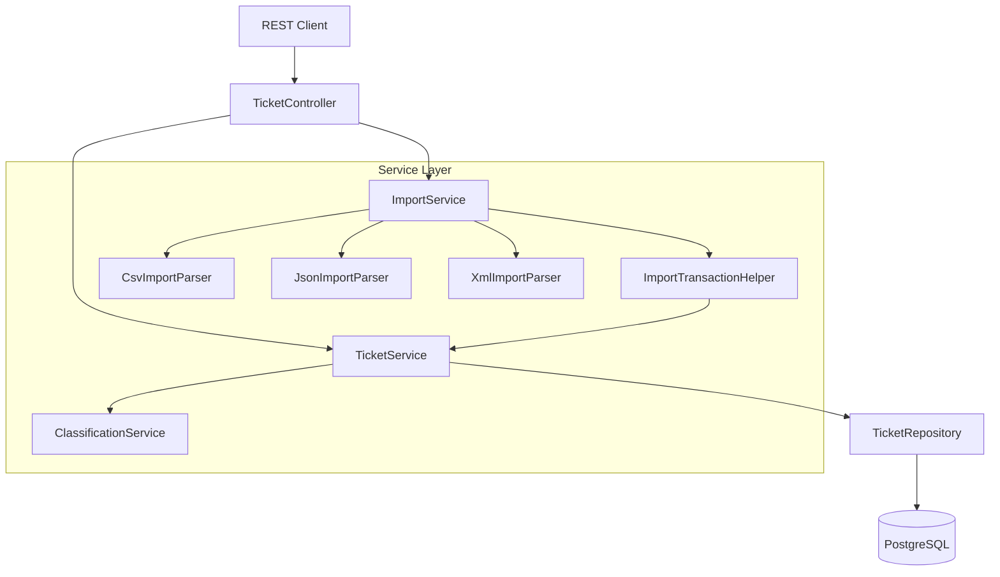

# SupportIQ Ticket System

A Spring Boot REST API for managing customer support tickets. The system supports multi-format bulk import (CSV, JSON, XML), keyword-based auto-classification of tickets by category and priority, and paginated listing with flexible filters.

## Quick Start

### Prerequisites

- **Java 21**
- **Maven 3.8+**
- **Docker & Docker Compose** (recommended for running the full stack)

### Option 1: Docker Compose (Recommended)

```bash
# Start the application and PostgreSQL
docker compose up -d --build

# Verify it's running
curl http://localhost:8080/api/tickets

# View logs
docker compose logs -f app

# Stop everything
docker compose down

# Stop and remove data
docker compose down -v
```

This starts:
- **PostgreSQL 16** on port 5432 (database: `supportiq`, user/password: `supportiq`)
- **SupportIQ App** on port 8080

Flyway migrations run automatically on startup.

### Option 2: Local Development (Maven)

```bash
# 1. Start PostgreSQL (using Docker)
docker run -d --name supportiq-db \
  -e POSTGRES_DB=supportiq \
  -e POSTGRES_USER=supportiq \
  -e POSTGRES_PASSWORD=supportiq \
  -p 5432:5432 \
  postgres:16-alpine

# 2. Build and run
mvn clean package -DskipTests
mvn spring-boot:run
```

The server starts on **http://localhost:8080**.

## Architecture Overview



## Project Structure

```
src/main/java/com/supportiq/ticket/
├── config/                  # Jackson, CORS, correlation-ID filter
├── controller/              # TicketController (REST endpoints)
├── dto/
│   ├── request/             # CreateTicketRequest, UpdateTicketRequest
│   └── response/            # TicketDto, ImportResultDto, ClassificationResultDto, etc.
├── entity/                  # TicketEntity, TicketMetadata (JPA)
├── enums/                   # TicketCategory, TicketPriority, TicketStatus, Source, DeviceType
├── exception/               # Custom exceptions + GlobalExceptionHandler
├── repository/              # TicketRepository, TicketSpecifications
└── service/
    ├── classification/      # ClassificationService, ClassificationResult
    ├── imports/             # ImportService, Csv/Json/XmlImportParser, ImportTransactionHelper
    └── TicketMapper.java
```

## API Endpoints

All endpoints are under `/api/tickets`.

| Method   | Path                          | Description                                  |
|----------|-------------------------------|----------------------------------------------|
| `POST`   | `/api/tickets`                | Create a new ticket                          |
| `GET`    | `/api/tickets/{id}`           | Get a ticket by ID                           |
| `GET`    | `/api/tickets`                | List tickets (paginated, filterable)         |
| `PUT`    | `/api/tickets/{id}`           | Update an existing ticket                    |
| `DELETE` | `/api/tickets/{id}`           | Delete a ticket                              |
| `POST`   | `/api/tickets/{id}/auto-classify` | Auto-classify a ticket (category + priority) |
| `POST`   | `/api/tickets/import`         | Bulk import tickets from CSV, JSON, or XML   |

### Create a Ticket

```bash
curl -X POST http://localhost:8080/api/tickets \
  -H "Content-Type: application/json" \
  -d '{
    "customer_id": "CUST-001",
    "customer_name": "John Doe",
    "customer_email": "john@example.com",
    "subject": "Cannot login to my account",
    "description": "I have been trying to log in for the past hour but keep getting errors",
    "category": "account_access",
    "priority": "high",
    "tags": ["login", "urgent"]
  }'
```

### Auto-Classify a Ticket

```bash
curl -X POST http://localhost:8080/api/tickets/{id}/auto-classify
```

### Filtering (GET /api/tickets)

Supports query parameters: `category`, `priority`, `status`, `email`, `assigned_to`, `createdAfter`, `createdBefore`, `tag`, plus standard Spring `Pageable` params (`page`, `size`, `sort`).

```bash
# Filter by assigned agent
curl 'http://localhost:8080/api/tickets?assigned_to=agent-42'

# Filter by category and status
curl 'http://localhost:8080/api/tickets?category=BILLING_QUESTION&status=NEW'

# Paginate
curl 'http://localhost:8080/api/tickets?page=0&size=10&sort=createdAt,desc'
```

### Import Tickets

Upload a file as `multipart/form-data` with parameter name `file`. Optionally pass `autoClassify=true` to classify each ticket on import. Maximum file size: 10 MB.

```bash
# Import from CSV
curl -X POST http://localhost:8080/api/tickets/import \
  -F "file=@sample-data/sample_tickets.csv"

# Import from JSON with auto-classification
curl -X POST http://localhost:8080/api/tickets/import \
  -F "file=@sample-data/sample_tickets.json" \
  -F "autoClassify=true"

# Import from XML
curl -X POST http://localhost:8080/api/tickets/import \
  -F "file=@sample-data/sample_tickets.xml"
```

### Validation Rules

| Field         | Constraint                      |
|---------------|---------------------------------|
| `customer_name` | Required, max 255 characters  |
| `customer_email` | Required, valid email format |
| `subject`     | Required, 1-200 characters      |
| `description` | Required, 10-2000 characters    |

### Error Response Format

All errors return a consistent JSON structure:

```json
{
  "status": 400,
  "error": "Bad Request",
  "message": "Validation failed",
  "path": "/api/tickets",
  "details": ["subject: Subject must be between 1 and 200 characters"],
  "timestamp": "2026-02-07T10:00:00Z"
}
```

## Running Tests

```bash
# Run unit and integration tests (performance tests excluded by default)
mvn test

# Run tests with JaCoCo coverage verification (85% line coverage minimum)
mvn verify

# Run only performance tests
mvn test -Dgroups=performance

# Run a specific test class
mvn test -Dtest=ClassificationServiceTest
```

Tests use **H2 in-memory** by default (via the `test` profile). Integration tests that need PostgreSQL use **Testcontainers** to spin up a container automatically -- Docker must be running for those.

## Technology Stack

- **Java 21**
- **Spring Boot 3.2.5** (Web, Data JPA, Validation)
- **PostgreSQL 16** with **Flyway** migrations
- **Docker & Docker Compose** for containerized deployment
- **OpenCSV 5.9** for CSV parsing
- **JAXB** (Jakarta XML Binding) for XML parsing
- **Jackson** for JSON serialization (snake_case)
- **JUnit 5** with **Spring Boot Test**
- **Testcontainers 1.20.4** for PostgreSQL integration tests
- **H2** for lightweight in-memory testing
- **JaCoCo 0.8.12** for code coverage enforcement
- **Maven** build system
