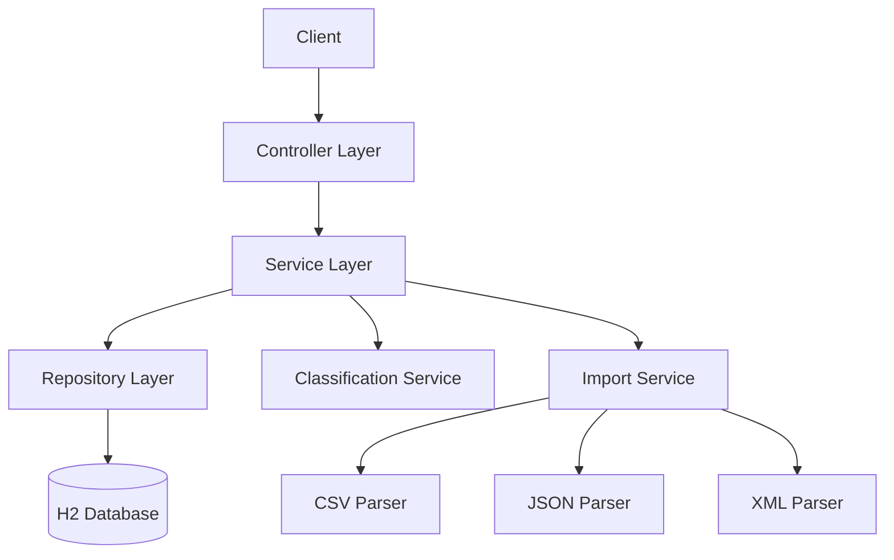

# Intelligent Customer Support System

Spring Boot application for managing support tickets with auto-classification and multi-format import.

## Features

- ✅ REST API for ticket CRUD operations
- ✅ Multi-format import (CSV, JSON, XML)
- ✅ Auto-classification by category and priority
- ✅ Filtering and search
- ✅ 85%+ test coverage

## Quick Start

### Prerequisites
- Java 17+
- Maven 3.6+

### Installation

```bash
# Clone the repository
cd homework-2

# Build the project
mvn clean install

# Run the application
mvn spring-boot:run
```

Server starts at `http://localhost:8080`

### Run Tests

```bash
# Run all tests
mvn test

# Generate coverage report
mvn test jacoco:report
```

View coverage: `target/site/jacoco/index.html`

## Architecture



## Project Structure

```
homework-2/
├── src/
│   ├── main/
│   │   ├── java/com/support/
│   │   │   ├── controller/      # REST endpoints
│   │   │   ├── service/         # Business logic
│   │   │   ├── model/           # Domain entities
│   │   │   ├── repository/      # Data access
│   │   │   ├── dto/             # Data transfer objects
│   │   │   └── exception/       # Error handling
│   │   └── resources/
│   │       └── application.properties
│   └── test/
│       └── java/com/support/    # Test suite (56 tests)
├── sample_tickets.csv           # 50 sample tickets
├── sample_tickets.json          # 20 sample tickets
├── sample_tickets.xml           # 30 sample tickets
├── invalid_tickets.*            # Test data for errors
└── pom.xml
```

## API Endpoints

| Method | Endpoint | Description |
|--------|----------|-------------|
| POST | `/tickets` | Create ticket |
| POST | `/tickets/import` | Bulk import |
| GET | `/tickets` | List all (with filters) |
| GET | `/tickets/{id}` | Get by ID |
| PUT | `/tickets/{id}` | Update ticket |
| DELETE | `/tickets/{id}` | Delete ticket |
| POST | `/tickets/{id}/auto-classify` | Auto-classify |

See [API_REFERENCE.md](docs/API_REFERENCE.md) for details.

## Testing

- **Unit Tests**: 35 tests
- **Integration Tests**: 5 tests  
- **Import Tests**: 16 tests
- **Coverage**: >85%

See [TESTING_GUIDE.md](docs/TESTING_GUIDE.md) for details.
