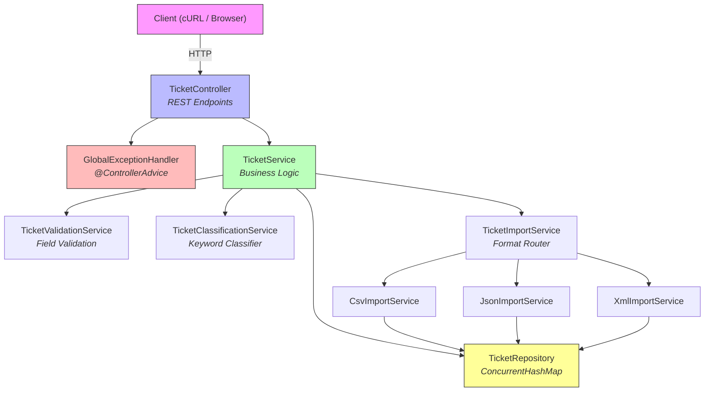
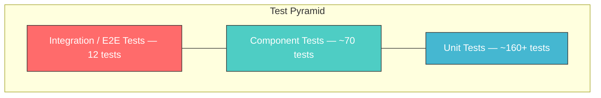

# Customer Support System (CSS)

An intelligent customer support ticket management system built with **Java 17** and **Spring Boot 4.0.3**. It imports tickets from multiple file formats (CSV, JSON, XML), automatically categorizes issues using keyword-based classification, and assigns priorities.

---

## Features

- **Multi-Format Import** — Bulk import tickets from CSV, JSON, and XML files with validation and detailed error reporting
- **Auto-Classification** — Keyword-based categorization and priority assignment with confidence scoring
- **RESTful API** — Full CRUD operations on support tickets with filtering by category, priority, status, and customer
- **Comprehensive Validation** — Email format, string length, enum values, and required field checks
- **Concurrent-Safe** — In-memory storage backed by `ConcurrentHashMap` for thread-safe operations
- **Test Coverage >85%** — 240+ tests across unit, integration, and performance layers

---

## Architecture Overview



### Test Pyramid



---

## Installation & Setup

### Prerequisites

- **Java 17** or higher
- **Gradle 8+** (or use the included Gradle wrapper)

### Clone & Build

```bash
git clone <repository-url>
cd homework-2
./gradlew build
```

### Run the Application

```bash
./gradlew bootRun
```

The server starts at **http://localhost:8080**.

### Quick Smoke Test

```bash
# Create a ticket
curl -s -X POST http://localhost:8080/tickets \
  -H "Content-Type: application/json" \
  -d '{
    "customer_id": "CUST001",
    "customer_email": "jane@example.com",
    "customer_name": "Jane Doe",
    "subject": "Cannot log in",
    "description": "I am unable to log in to my account since yesterday morning."
  }' | python3 -m json.tool
```

---

## Running Tests

```bash
# Run all tests
./gradlew test

# Run tests with coverage report
./gradlew test jacocoTestReport

# View HTML coverage report
open build/reports/jacoco/test/html/index.html      # macOS
xdg-open build/reports/jacoco/test/html/index.html   # Linux
```

### Test Summary

| Test Suite | # Tests | Scope |
|------------|---------|-------|
| TicketControllerTest | 11 | REST endpoints (MockMvc) |
| TicketServiceTest | ~20 | Service layer (Mockito) |
| TicketClassificationServiceTest | ~38 | Classification logic |
| CsvImportServiceTest | 14 | CSV parsing edge cases |
| JsonImportServiceTest | 13 | JSON import |
| XmlImportServiceTest | 13 | XML import |
| TicketImportServiceTest | 7 | Import routing |
| TicketRepositoryTest | 14 | In-memory CRUD & filtering |
| TicketModelTest | ~50 | Model + enum coverage |
| DTO Tests | ~59 | Request/Response DTOs |
| ExceptionTests | ~21 | Exception handling |
| TicketIntegrationTest | 12 | End-to-end workflows |

---

## API Endpoints

| Method | Endpoint | Description |
|--------|----------|-------------|
| `POST` | `/tickets` | Create a new ticket |
| `POST` | `/tickets/import` | Bulk import from CSV/JSON/XML |
| `GET` | `/tickets` | List all tickets (with filtering) |
| `GET` | `/tickets/{id}` | Get a specific ticket |
| `PUT` | `/tickets/{id}` | Update a ticket |
| `DELETE` | `/tickets/{id}` | Delete a ticket |
| `POST` | `/tickets/{id}/auto-classify` | Auto-classify a ticket |

See [API_REFERENCE.md](API_REFERENCE.md) for full request/response examples.

---

## Sample Data

Pre-built sample data files are located in `src/main/resources/sample-data/`:

| File | Format | Records |
|------|--------|---------|
| `sample_tickets.csv` | CSV | 50 |
| `sample_tickets.json` | JSON | 20 |
| `sample_tickets.xml` | XML | 30 |

Import example:

```bash
curl -X POST http://localhost:8080/tickets/import \
  -F "file=@src/main/resources/sample-data/sample_tickets.json"
```

---

## Related Documentation

- [API_REFERENCE.md](API_REFERENCE.md) — Full API documentation with cURL examples
- [ARCHITECTURE.md](ARCHITECTURE.md) — System design, data flow, and trade-offs
- [TESTING_GUIDE.md](TESTING_GUIDE.md) — Test strategy, running tests, and manual testing checklist
