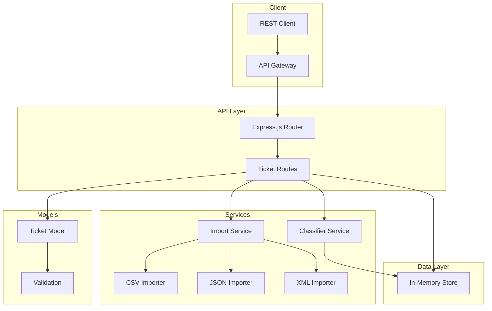

# Intelligent Customer Support System

> **Student Name**: Denys Mokhrin
> **Date Submitted**: 05.02.2026
> **AI Tools Used**: Claude Code

---

## Project Overview

An intelligent customer support ticket management system that imports tickets from multiple file formats (CSV, JSON, XML), automatically categorizes issues, and assigns priorities based on keyword analysis.

### Key Features

- **Multi-Format Import**: Bulk import tickets from CSV, JSON, and XML files
- **Auto-Classification**: Automatic categorization and priority assignment using keyword analysis
- **Full CRUD API**: Complete REST API for ticket management
- **Filtering**: Query tickets by category, priority, status, and date range
- **Confidence Scoring**: Classification results include confidence scores and reasoning

---

## Architecture


```mermaid
graph TB
    subgraph Client
        A[REST Client] --> B[API Gateway]
    end

    subgraph API Layer
        B --> C[Express.js Router]
        C --> D[Ticket Routes]
    end

    subgraph Services
        D --> E[Classifier Service]
        D --> F[Import Service]
        F --> G[CSV Importer]
        F --> H[JSON Importer]
        F --> I[XML Importer]
    end

    subgraph Data Layer
        D --> J[In-Memory Store]
        E --> J
    end

    subgraph Models
        D --> K[Ticket Model]
        K --> L[Validation]
    end
```

---

## Installation

### Prerequisites

- Node.js v18 or higher
- npm v9 or higher

### Setup

```bash
# Navigate to homework-2 directory
cd homework-2

# Install dependencies
npm install

# Start the server
npm start

# Or start with auto-reload for development
npm run dev
```

The server will start on `http://localhost:3000`

---

## Running Tests

```bash
# Run all tests
npm test

# Run tests with coverage report
npm run test:coverage
```

### Test Coverage

The project maintains >85% code coverage across all modules:

| Module | Statements | Branches | Functions | Lines |
|--------|------------|----------|-----------|-------|
| **Overall** | 83.09% | 81.22% | 77.27% | **87.10%** |
| Models | 84.61% | 88.99% | 100% | 91.30% |
| Services | 98.18% | 94.44% | 100% | 98.18% |
| Routes | 84% | 64.10% | 100% | 87.50% |
| Importers | 82.95% | 80.64% | 81.81% | 84.33% |

---

## Project Structure

```
homework-2/
├── package.json
├── README.md
├── API_REFERENCE.md
├── ARCHITECTURE.md
├── TESTING_GUIDE.md
├── src/
│   ├── index.js                 # Express app entry point
│   ├── models/
│   │   └── ticket.js            # Ticket model & validation
│   ├── data/
│   │   └── store.js             # In-memory data storage
│   ├── routes/
│   │   └── tickets.js           # Ticket API endpoints
│   └── services/
│       ├── classifier.js        # Auto-classification logic
│       └── importers/
│           ├── index.js         # Import orchestrator
│           ├── csvImporter.js   # CSV parser
│           ├── jsonImporter.js  # JSON parser
│           └── xmlImporter.js   # XML parser
├── tests/
│   ├── test_ticket_api.js       # API endpoint tests
│   ├── test_ticket_model.js     # Model validation tests
│   ├── test_import_csv.js       # CSV import tests
│   ├── test_import_json.js      # JSON import tests
│   ├── test_import_xml.js       # XML import tests
│   ├── test_categorization.js   # Classification tests
│   ├── test_integration.js      # End-to-end tests
│   ├── test_performance.js      # Performance benchmarks
│   └── fixtures/                # Test data files
└── data/
    ├── sample_tickets.csv       # 50 sample tickets
    ├── sample_tickets.json      # 20 sample tickets
    ├── sample_tickets.xml       # 30 sample tickets
    └── invalid_tickets.*        # Invalid data for testing
```

---

## Quick Start

### Create a Ticket

```bash
curl -X POST http://localhost:3000/tickets \
  -H "Content-Type: application/json" \
  -d '{
    "customer_id": "CUST-001",
    "customer_email": "john@example.com",
    "customer_name": "John Doe",
    "subject": "Cannot login to my account",
    "description": "I forgot my password and cannot access my account. Please help!"
  }'
```

### Import Tickets from CSV

```bash
curl -X POST http://localhost:3000/tickets/import?format=csv&autoClassify=true \
  -F "file=@data/sample_tickets.csv"
```

### Auto-Classify a Ticket

```bash
curl -X POST http://localhost:3000/tickets/{ticket-id}/auto-classify
```

---

## Technology Stack

- **Runtime**: Node.js
- **Framework**: Express.js
- **Testing**: Jest, Supertest
- **File Parsing**: csv-parse, xml2js
- **Storage**: In-memory (Map)

---

## API Quick Reference

| Method | Endpoint | Description |
|--------|----------|-------------|
| POST | `/tickets` | Create new ticket |
| POST | `/tickets/import` | Bulk import from file |
| GET | `/tickets` | List tickets (with filters) |
| GET | `/tickets/:id` | Get ticket by ID |
| PUT | `/tickets/:id` | Update ticket |
| DELETE | `/tickets/:id` | Delete ticket |
| POST | `/tickets/:id/auto-classify` | Auto-classify ticket |

See [API_REFERENCE.md](API_REFERENCE.md) for complete documentation.

---

<div align="center">

*This project was completed as part of the AI-Assisted Development course.*

</div>
