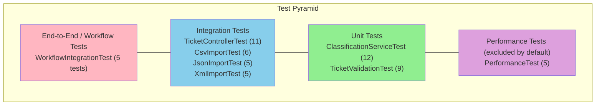

# SupportIQ Ticket System -- Testing Guide

## Test Architecture

The test suite follows a layered test pyramid strategy. Unit tests form the foundation for fast, isolated validation. Integration tests verify HTTP endpoints and file import pipelines against a real database. End-to-end workflow tests exercise multi-step business scenarios. Performance tests (excluded from the default build) guard against response-time regressions.



**Total: 58 tests** (53 in the default run, 5 performance tests excluded by default)

### Infrastructure

| Component | Purpose |
|---|---|
| `BaseIntegrationTest` | Abstract base class for all integration tests. Boots the full Spring context with `@SpringBootTest`, auto-configures `MockMvc`, and cleans the database before each test via `@BeforeEach`. |
| `TestcontainersConfig` | `@TestConfiguration` bean that provides a PostgreSQL 16 (Alpine) Testcontainers instance wired through `@ServiceConnection`. The container is named `supportiq_test`. |
| `application-test.yml` | Spring profile activated by `@ActiveProfiles("test")` in the base class. |

---

## Running Tests

### Standard commands

```bash
# Run all tests except performance (default surefire config excludes the "performance" tag)
mvn test

# Run only performance tests
mvn test -Dgroups=performance

# Full build with JaCoCo coverage enforcement (85% line-coverage threshold)
mvn verify

# Generate the HTML coverage report (output: target/site/jacoco/index.html)
mvn jacoco:report

# Run a specific test class
mvn test -Dtest="ClassificationServiceTest"

# Run a single test method
mvn test -Dtest="ClassName#methodName"
```

### Prerequisites

- **Java 21** (required by `pom.xml` property `java.version`)
- **Docker** running (Testcontainers spins up a PostgreSQL 16 container for integration tests)
- **Maven 3.9+** (or use the included wrapper if present)

---

## Test Fixtures

All fixture files live in `src/test/resources/fixtures/`. Each format (CSV, JSON, XML) has a parallel set of files to ensure consistent coverage across import parsers.

| Fixture file | Formats | Description |
|---|---|---|
| `valid_tickets` | `.csv`, `.json`, `.xml` | 5 well-formed records that should all import successfully. |
| `invalid_tickets` | `.csv`, `.json`, `.xml` | Records containing validation errors (missing required fields, bad emails, etc.). All records should fail validation. |
| `malformed` | `.csv`, `.json`, `.xml` | Structurally broken files (corrupt syntax, mismatched tags/brackets). The import endpoint should return HTTP 400. |
| `mixed_valid_invalid` | `.csv`, `.json`, `.xml` | A mix of valid and invalid records. Expect partial success: some records import, some are rejected. |
| `empty` | `.csv`, `.json`, `.xml` | Empty datasets (no ticket records). Import should succeed with `total_records: 0`. |
| `classification_test_tickets` | `.json` | Dedicated dataset used by classification-related tests to verify keyword-based category and priority assignment. |

---

## Test Categories

### Unit Tests

| Class | Tests | Description |
|---|---|---|
| `ClassificationServiceTest` | 12 | Validates the keyword-based `ClassificationService` in isolation (no Spring context). Covers all six ticket categories (`ACCOUNT_ACCESS`, `TECHNICAL_ISSUE`, `BILLING_QUESTION`, `FEATURE_REQUEST`, `BUG_REPORT`, `OTHER`), priority assignment (`URGENT`, `HIGH`, `MEDIUM`, `LOW`), confidence scoring, confidence cap at 1.0, and reasoning output. |
| `TicketValidationTest` | 9 | Exercises Bean Validation (`jakarta.validation`) constraints on `CreateTicketRequest`. Tests blank/null customer name, invalid/blank email, blank subject, blank description, subject exceeding 500 characters, and description exceeding 10,000 characters. Uses a standalone `Validator` without Spring. |

### Integration Tests

| Class | Tests | Description |
|---|---|---|
| `TicketControllerTest` | 11 | Full REST API coverage for the `/api/tickets` resource. Tests CRUD operations (create, get, list, update, delete), input validation error responses (400), not-found responses (404), category filtering, and the `/api/tickets/{id}/classify` classification endpoint. |
| `CsvImportTest` | 6 | Tests the CSV import pipeline via `POST /api/tickets/import` with `multipart/form-data`. Covers valid import, invalid records, malformed file (400), mixed valid/invalid, empty file, and auto-classification on import (`autoClassify=true`). |
| `JsonImportTest` | 5 | Same import scenarios as CSV but with `application/json` fixtures. Covers valid, invalid, malformed (400), mixed, and empty datasets. |
| `XmlImportTest` | 5 | Same import scenarios as CSV but with `application/xml` fixtures. Covers valid, invalid, malformed (400), mixed, and empty datasets. |

### End-to-End / Workflow Tests

| Class | Tests | Description |
|---|---|---|
| `WorkflowIntegrationTest` | 5 | Multi-step business workflows exercised through the API. Includes: (1) full ticket lifecycle -- create, classify, update to in_progress, resolve; (2) import-and-classify workflow with JSON fixtures; (3) create-and-filter workflow by email; (4) pagination over multiple tickets; (5) unsupported import format returns HTTP 415. |

### Performance Tests

| Class | Tests | Description |
|---|---|---|
| `PerformanceTest` | 5 | Response-time assertions guarding critical endpoints. Tagged with `@Tag("performance")` and excluded from the default Maven Surefire run (`<excludedGroups>performance</excludedGroups>`). Thresholds: create ticket < 500 ms, list 100 tickets < 1000 ms, classify ticket < 200 ms, CSV import (5 records) < 2000 ms, filtered query over 50 records < 500 ms. |

---

## Manual Testing Checklist

Use this checklist for quick manual verification after significant changes. Start the application with Docker and Postgres running.

### Ticket CRUD

- [ ] `POST /api/tickets` -- create a ticket with all required fields and verify 201 response with generated UUID
- [ ] `POST /api/tickets` -- submit with missing fields and verify 400 response with validation details
- [ ] `GET /api/tickets/{id}` -- retrieve the created ticket and verify all fields match
- [ ] `GET /api/tickets/{id}` -- request a non-existent UUID and verify 404 response
- [ ] `GET /api/tickets` -- list all tickets and verify paginated response structure (`content`, `total_elements`, `total_pages`)
- [ ] `GET /api/tickets?category=billing_question` -- filter by category and verify only matching tickets are returned
- [ ] `GET /api/tickets?email=user@example.com` -- filter by email and verify correct results
- [ ] `PUT /api/tickets/{id}` -- update status and priority, verify 200 with updated values
- [ ] `DELETE /api/tickets/{id}` -- delete a ticket and verify 204, then confirm 404 on re-fetch

### Classification

- [ ] `POST /api/tickets/{id}/classify` -- classify a ticket with login/password keywords and verify `account_access` category
- [ ] Verify the classification response includes `category`, `priority`, `confidence`, `reasoning`, and `keywords`

### File Import

- [ ] `POST /api/tickets/import` with a valid CSV file -- verify 201 with `successful: 5`
- [ ] `POST /api/tickets/import` with a valid JSON file -- verify 201 with `successful: 5`
- [ ] `POST /api/tickets/import` with a valid XML file -- verify 201 with `successful: 5`
- [ ] `POST /api/tickets/import` with a malformed file -- verify 400 response
- [ ] `POST /api/tickets/import` with `autoClassify=true` -- verify tickets are classified after import
- [ ] `POST /api/tickets/import` with an unsupported format (e.g., `.txt`) -- verify 415 response

### Coverage

- [ ] Run `mvn verify` and confirm the JaCoCo coverage check passes (85% line coverage minimum)
- [ ] Open `target/site/jacoco/index.html` and review per-package coverage
