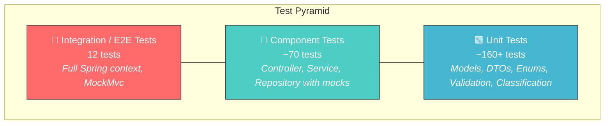

# Testing Guide

A comprehensive guide for QA engineers covering test strategy, execution, sample data, and manual testing procedures for the Customer Support System (CSS).

---

## Table of Contents

- [Test Pyramid](#test-pyramid)
- [Running Tests](#running-tests)
- [Test Suites Overview](#test-suites-overview)
- [Sample Test Data](#sample-test-data)
- [Manual Testing Checklist](#manual-testing-checklist)
- [Performance Benchmarks](#performance-benchmarks)

---

## Test Pyramid

The project follows a standard test pyramid with a heavy base of unit tests, a mid-layer of component tests, and a top layer of integration/end-to-end tests.



| Layer | Test Count | Execution Speed | Scope |
|-------|-----------|-----------------|-------|
| Unit | ~160+ | < 1s | Single class, no Spring context |
| Component | ~70 | ~2s | Service/controller with mocked dependencies |
| Integration | 12 | ~5s | Full Spring Boot context, end-to-end flows |
| **Total** | **~240+** | **< 10s** | |

---

## Running Tests

### Run All Tests

```bash
./gradlew test
```

### Run Tests with Coverage Report

```bash
./gradlew test jacocoTestReport
```

### View Coverage Reports

```bash
# HTML report (interactive)
open build/reports/jacoco/test/html/index.html        # macOS
xdg-open build/reports/jacoco/test/html/index.html     # Linux

# XML report (for CI pipelines)
cat build/reports/jacoco/test/jacocoTestReport.xml

# Test results summary
open build/reports/tests/test/index.html
```

### Run a Specific Test Class

```bash
# Run a single test class
./gradlew test --tests "com.css.service.TicketClassificationServiceTest"

# Run a single test method
./gradlew test --tests "com.css.service.TicketClassificationServiceTest.testClassifyAccountAccess"

# Run all tests in a package
./gradlew test --tests "com.css.service.*"

# Run integration tests only
./gradlew test --tests "com.css.integration.*"
```

### Continuous Testing During Development

```bash
# Re-run tests on changes (requires --continuous flag)
./gradlew test --continuous
```

---

## Test Suites Overview

### Unit Tests

| Test File | Tests | What It Validates |
|-----------|-------|-------------------|
| `TicketModelTest` | ~50 | Ticket entity fields, defaults (`status=NEW`, `createdAt`, UUID generation), all 5 enum types (`TicketCategory`, `TicketPriority`, `TicketStatus`, `TicketSource`, `DeviceType`) with `@JsonValue`/`@JsonCreator`, case-insensitive parsing, invalid value handling |
| `CreateTicketRequestTest` | 16 | All getter/setter pairs, `MetadataRequest` nested class |
| `UpdateTicketRequestTest` | 15 | All getter/setter pairs, partial update fields |
| `ErrorResponseTest` | 13 | Constructor, field errors map, timestamp auto-generation |
| `ImportResultTest` | 15 | Counters, error list, imported IDs, `ImportError` inner class |
| `ExceptionClassesTest` | 11 | `TicketNotFoundException`, `ValidationException` (with field errors), `ImportException` (with cause) |

### Component Tests

| Test File | Tests | What It Validates |
|-----------|-------|-------------------|
| `TicketControllerTest` | 11 | All 7 REST endpoints via MockMvc with mocked services: create (201), import, list, get by ID, update, delete (204), auto-classify, not-found (404), validation error (400) |
| `TicketServiceTest` | ~20 | Create with defaults, create with auto-classify, update (partial fields, status transitions, `resolved_at`), delete, not-found exceptions, `getFilteredTickets`, `getAllTickets` |
| `TicketClassificationServiceTest` | ~38 | All 5 category classifications, all 4 priority levels, confidence scoring, keyword matching, default fallbacks, edge cases (empty text, mixed categories), parameterized tests |
| `TicketRepositoryTest` | 14 | Save, find by ID, find all, filtered queries (each filter param), delete, `existsById`, `count`, `deleteAll` |
| `GlobalExceptionHandlerTest` | 10 | Each exception type → correct HTTP status code mapping, error response structure |

### Import Tests

| Test File | Tests | What It Validates |
|-----------|-------|-------------------|
| `TicketImportServiceTest` | 7 | Routing to correct importer (CSV/JSON/XML), null filename, missing extension, unsupported format, empty filename |
| `CsvImportServiceTest` | 14 | Valid CSV, missing headers, empty rows, invalid email, short description, unknown enum fallbacks, quoted fields, malformed files |
| `JsonImportServiceTest` | 13 | Valid JSON array, invalid JSON syntax, missing required fields, unknown enums, empty array, nested metadata |
| `XmlImportServiceTest` | 13 | Valid XML, malformed XML, missing fields, nested tags, metadata parsing, XXE protection, empty `<tickets>` |

### Integration Tests

| Test File | Tests | What It Validates |
|-----------|-------|-------------------|
| `TicketIntegrationTest` | 12 | Full ticket lifecycle (create → read → update → resolve → delete), auto-classify on creation, bulk import with auto-classification (JSON/CSV/XML), concurrent operations (25 simultaneous creates, 25 mixed operations, 25 concurrent classifies), combined filtering, partial import success, classification persistence |

---

## Sample Test Data

### File Locations

| File | Path | Records | Format |
|------|------|---------|--------|
| CSV sample | `src/main/resources/sample-data/sample_tickets.csv` | 50 | Comma-separated, pipe-delimited tags |
| JSON sample | `src/main/resources/sample-data/sample_tickets.json` | 20 | Array of objects |
| XML sample | `src/main/resources/sample-data/sample_tickets.xml` | 30 | `<tickets><ticket>` structure |

### CSV Format

```csv
customer_id,customer_email,customer_name,subject,description,category,priority,status,assigned_to,tags,source,browser,device_type
CUST001,user1@example.com,Alice Johnson,Cannot log in,...,account_access,high,new,,login|access,web_form,Chrome 120,desktop
```

- Tags are **pipe-delimited** (`login|access`)
- All headers must be present in the first row

### JSON Format

```json
[
  {
    "customer_id": "CUST101",
    "customer_email": "user@example.com",
    "customer_name": "Bob Smith",
    "subject": "Payment failed",
    "description": "My payment was declined when trying to upgrade my subscription plan.",
    "category": "billing_question",
    "priority": "high",
    "tags": ["payment", "billing"],
    "metadata": {
      "source": "web_form",
      "browser": "Firefox 121",
      "device_type": "desktop"
    }
  }
]
```

### XML Format

```xml
<?xml version="1.0" encoding="UTF-8"?>
<tickets>
  <ticket>
    <customer_id>CUST201</customer_id>
    <customer_email>user@example.com</customer_email>
    <customer_name>Carol White</customer_name>
    <subject>App crashes on startup</subject>
    <description>The mobile application crashes immediately after opening on my Android device.</description>
    <category>technical_issue</category>
    <priority>urgent</priority>
    <tags>
      <tag>crash</tag>
      <tag>mobile</tag>
    </tags>
    <metadata>
      <source>email</source>
      <browser>Mobile Safari</browser>
      <device_type>mobile</device_type>
    </metadata>
  </ticket>
</tickets>
```

### Invalid Data for Negative Tests

Use these payloads to test validation:

| Scenario | Field | Invalid Value |
|----------|-------|---------------|
| Missing required field | `customer_id` | `null` or omitted |
| Invalid email | `customer_email` | `"not-an-email"` |
| Subject too long | `subject` | 201+ characters |
| Description too short | `description` | `"Short"` (< 10 chars) |
| Invalid enum | `category` | `"invalid_category"` |
| Empty file | — | Upload a 0-byte file |
| Wrong file extension | — | Upload a `.txt` file |
| Malformed JSON | — | `{ broken json` |
| Malformed XML | — | `<tickets><unclosed` |
| Malformed CSV | — | Missing header row |

---

## Manual Testing Checklist

### Ticket CRUD

- [ ] **Create ticket** — `POST /tickets` with all required fields → `201 Created`
- [ ] **Create ticket with auto-classify** — `POST /tickets` with `"auto_classify": true` → ticket has classification fields populated
- [ ] **Create ticket with missing required field** — omit `customer_email` → `400 Bad Request` with field error
- [ ] **Create ticket with invalid email** — `"customer_email": "bad"` → `400 Bad Request`
- [ ] **Create ticket with short description** — less than 10 chars → `400 Bad Request`
- [ ] **Get all tickets** — `GET /tickets` → `200 OK` with array
- [ ] **Get ticket by ID** — `GET /tickets/{id}` → `200 OK` with ticket
- [ ] **Get non-existent ticket** — `GET /tickets/{random-uuid}` → `404 Not Found`
- [ ] **Update ticket** — `PUT /tickets/{id}` with partial body → `200 OK`, only specified fields changed
- [ ] **Update status to resolved** — verify `resolved_at` is set
- [ ] **Delete ticket** — `DELETE /tickets/{id}` → `204 No Content`
- [ ] **Delete non-existent ticket** — → `404 Not Found`

### Filtering

- [ ] **Filter by category** — `GET /tickets?category=billing_question` → only billing tickets
- [ ] **Filter by priority** — `GET /tickets?priority=urgent` → only urgent tickets
- [ ] **Filter by status** — `GET /tickets?status=new` → only new tickets
- [ ] **Filter by customer** — `GET /tickets?customerId=CUST001` → only that customer's tickets
- [ ] **Combined filters** — `GET /tickets?category=bug_report&priority=high` → intersection

### Import

- [ ] **Import CSV** — `POST /tickets/import` with `sample_tickets.csv` → `200 OK` with import summary
- [ ] **Import JSON** — same with `.json` file → `200 OK`
- [ ] **Import XML** — same with `.xml` file → `200 OK`
- [ ] **Import with invalid records** — file with some bad records → partial success, errors listed
- [ ] **Import unsupported format** — `.txt` file → `400 Bad Request`
- [ ] **Import empty file** — → `400 Bad Request`

### Auto-Classification

- [ ] **Classify account access ticket** — subject/description with "login", "password" → `account_access`
- [ ] **Classify billing ticket** — keywords "payment", "invoice" → `billing_question`
- [ ] **Classify with urgent priority** — "critical", "production down" → `urgent`
- [ ] **Classify ambiguous ticket** — no matching keywords → `other` category, `medium` priority
- [ ] **Verify confidence score** — returns value between 0.0 and 1.0
- [ ] **Verify classification persists** — `GET /tickets/{id}` after classify shows updated fields

---

## Performance Benchmarks

The integration test suite includes concurrent operation tests. Expected benchmarks on a standard development machine:

| Operation | Concurrent Requests | Expected Result | Acceptance Criteria |
|-----------|-------------------|-----------------|---------------------|
| Ticket creation | 25 simultaneous | All succeed | 25/25 created, no data loss |
| Mixed operations (create + read + update) | 25 simultaneous | All succeed | No exceptions, data consistency |
| Concurrent classification | 25 simultaneous | All succeed | All tickets classified correctly |
| CSV import (50 records) | 1 | < 1s | All valid records imported |
| JSON import (20 records) | 1 | < 500ms | All valid records imported |
| XML import (30 records) | 1 | < 500ms | All valid records imported |

### Running Performance-Related Tests

```bash
# Run integration tests (includes concurrency tests)
./gradlew test --tests "com.css.integration.TicketIntegrationTest"
```

### Key Concurrent Test Scenarios

1. **25 Simultaneous Creates** — Uses `ExecutorService` with a fixed thread pool. Verifies all 25 tickets are created and retrievable.
2. **25 Mixed Operations** — Concurrent creates, reads, and updates on overlapping data. Verifies no `ConcurrentModificationException` or data corruption.
3. **25 Concurrent Classifications** — Simultaneously classifies 25 different tickets. Verifies all results contain valid category/priority/confidence values.

### Memory Profile

| Dataset Size | Approx. Memory |
|-------------|----------------|
| 100 tickets | ~1 MB |
| 1,000 tickets | ~10 MB |
| 10,000 tickets | ~100 MB |

> **Note:** Memory estimates are approximate. Actual usage depends on ticket content size (description length, tags, metadata).
