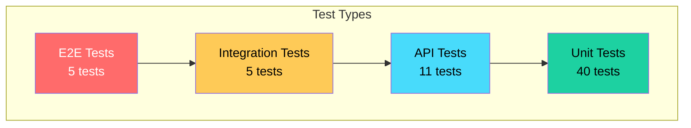

# Testing Guide

Comprehensive testing documentation for QA Engineers.

---

## Test Pyramid


```mermaid
graph TB
    subgraph "Test Types"
        A[E2E Tests<br/>5 tests]
        B[Integration Tests<br/>5 tests]
        C[API Tests<br/>11 tests]
        D[Unit Tests<br/>40 tests]
    end

    A --> B --> C --> D

    style A fill:#ff6b6b,color:#fff
    style B fill:#feca57,color:#000
    style C fill:#48dbfb,color:#000
    style D fill:#1dd1a1,color:#000
```

### Test Distribution

| Level | Test File | Tests | Description |
|-------|-----------|-------|-------------|
| Unit | `test_ticket_model.js` | 9 | Data validation |
| Unit | `test_import_csv.js` | 6 | CSV parsing |
| Unit | `test_import_json.js` | 5 | JSON parsing |
| Unit | `test_import_xml.js` | 5 | XML parsing |
| Unit | `test_categorization.js` | 10 | Classification logic |
| API | `test_ticket_api.js` | 11 | REST endpoints |
| Integration | `test_integration.js` | 5 | E2E workflows |
| Performance | `test_performance.js` | 5 | Benchmarks |
| **Total** | | **61** | |

---

## Running Tests

### All Tests

```bash
npm test
```

### With Coverage Report

```bash
npm run test:coverage
```

### Specific Test File

```bash
npx jest tests/test_ticket_api.js
```

### Watch Mode (for development)

```bash
npx jest --watch
```

### Verbose Output

```bash
npx jest --verbose
```

---

## Test Coverage Requirements

**Minimum Required: >85%**

### Current Coverage

| File | Statements | Branches | Functions | Lines |
|------|------------|----------|-----------|-------|
| **All files** | 83.09% | 81.22% | 77.27% | **87.10%** |
| store.js | 61.70% | 61.11% | 55.55% | 69.23% |
| ticket.js | 84.61% | 88.99% | 100% | 91.30% |
| tickets.js | 84% | 64.10% | 100% | 87.50% |
| classifier.js | 98.18% | 94.44% | 100% | 98.18% |
| csvImporter.js | 83.33% | 88.88% | 100% | 81.25% |
| jsonImporter.js | 81.81% | 85% | 100% | 80% |
| xmlImporter.js | 72% | 69.44% | 50% | 78.26% |
| index.js (importers) | 91.17% | 90% | 100% | 91.17% |

---

## Sample Test Data Locations

| File | Location | Records | Purpose |
|------|----------|---------|---------|
| CSV Sample | `data/sample_tickets.csv` | 50 | Valid bulk import |
| JSON Sample | `data/sample_tickets.json` | 20 | Valid JSON import |
| XML Sample | `data/sample_tickets.xml` | 30 | Valid XML import |
| Invalid CSV | `data/invalid_tickets.csv` | 8 | Validation error testing |
| Invalid JSON | `data/invalid_tickets.json` | 6 | Validation error testing |
| Invalid XML | `data/invalid_tickets.xml` | 4 | Validation error testing |
| Malformed JSON | `data/malformed.json` | N/A | Parser error testing |
| Malformed XML | `data/malformed.xml` | N/A | Parser error testing |
| Fixture | `tests/fixtures/valid_ticket.json` | 1 | Unit test fixture |

---

## Manual Testing Checklist

### Ticket CRUD Operations

- [ ] Create ticket with all required fields
- [ ] Create ticket with optional fields (tags, metadata)
- [ ] Create ticket with autoClassify=true
- [ ] Get all tickets
- [ ] Get ticket by valid ID
- [ ] Get ticket by invalid ID (should return 404)
- [ ] Update ticket status
- [ ] Update ticket priority
- [ ] Update ticket assigned_to
- [ ] Delete ticket
- [ ] Delete non-existent ticket (should return 404)

### Bulk Import

- [ ] Import valid CSV file
- [ ] Import valid JSON file
- [ ] Import valid XML file
- [ ] Import with autoClassify=true
- [ ] Import file with validation errors
- [ ] Import malformed file (should fail gracefully)
- [ ] Import without specifying format (should use file extension)
- [ ] Import without file (should return 400)

### Filtering

- [ ] Filter by category
- [ ] Filter by priority
- [ ] Filter by status
- [ ] Filter by assigned_to
- [ ] Filter by customer_id
- [ ] Filter by date range (from/to)
- [ ] Combined filters (category + priority)

### Auto-Classification

- [ ] Classify account_access ticket
- [ ] Classify technical_issue ticket
- [ ] Classify billing_question ticket
- [ ] Classify feature_request ticket
- [ ] Classify bug_report ticket
- [ ] Verify urgent priority detection
- [ ] Verify high priority detection
- [ ] Verify low priority detection
- [ ] Classify with apply=false (dry run)

### Edge Cases

- [ ] Create ticket with minimum description length (10 chars)
- [ ] Create ticket with maximum description length (2000 chars)
- [ ] Create ticket with maximum subject length (200 chars)
- [ ] Create ticket with invalid email format
- [ ] Create ticket with invalid category
- [ ] Create ticket with invalid priority
- [ ] Update ticket to resolved status (should set resolved_at)

---

## Performance Benchmarks

| Test | Target | Status |
|------|--------|--------|
| Create 100 tickets concurrently | <2 seconds | ✅ Pass |
| Retrieve 1000 tickets | <500ms | ✅ Pass |
| Classify 100 tickets | <100ms | ✅ Pass |
| Filter 500 tickets by category | <100ms | ✅ Pass |
| Filter 500 tickets with multiple criteria | <100ms | ✅ Pass |

### Running Performance Tests Only

```bash
npx jest tests/test_performance.js
```

---

## Test Configuration

### Jest Configuration (package.json)

```json
{
  "jest": {
    "testMatch": ["**/tests/test_*.js"],
    "testEnvironment": "node",
    "collectCoverageFrom": [
      "src/**/*.js",
      "!src/index.js"
    ],
    "coverageDirectory": "coverage",
    "coverageReporters": ["text", "lcov", "html"]
  }
}
```

### Coverage Report Location

After running `npm run test:coverage`:

- Text summary: Console output
- HTML report: `coverage/lcov-report/index.html`
- LCOV data: `coverage/lcov.info`

---

## Debugging Failed Tests

### 1. Run single test with verbose output

```bash
npx jest tests/test_ticket_api.js --verbose
```

### 2. Run specific test by name

```bash
npx jest -t "creates a new ticket"
```

### 3. Debug with console.log

Tests run with full console output. Add `console.log()` statements to debug.

### 4. Check test isolation

Each test file calls `resetStore()` in `beforeEach` to ensure clean state.

---

## Adding New Tests

### Unit Test Template

```javascript
const { functionToTest } = require('../src/module');

describe('Module Name', () => {
  beforeEach(() => {
    // Setup
  });

  test('should do something', () => {
    const result = functionToTest(input);
    expect(result).toBe(expected);
  });
});
```

### API Test Template

```javascript
const request = require('supertest');
const app = require('../src/index');
const { resetStore } = require('../src/data/store');

describe('Endpoint Name', () => {
  beforeEach(() => {
    resetStore();
  });

  test('returns 200 for valid request', async () => {
    const res = await request(app).get('/endpoint');
    expect(res.status).toBe(200);
  });
});
```

---

## CI/CD Integration

### GitHub Actions Example

```yaml
name: Tests
on: [push, pull_request]
jobs:
  test:
    runs-on: ubuntu-latest
    steps:
      - uses: actions/checkout@v3
      - uses: actions/setup-node@v3
        with:
          node-version: '18'
      - run: npm ci
      - run: npm run test:coverage
      - name: Check coverage threshold
        run: |
          COVERAGE=$(npx jest --coverage --coverageReporters=json-summary | grep -o '"lines":{"total":[0-9]*,"covered":[0-9]*,"pct":[0-9.]*' | grep -o '[0-9.]*$')
          if (( $(echo "$COVERAGE < 85" | bc -l) )); then
            echo "Coverage $COVERAGE% is below 85% threshold"
            exit 1
          fi
```
