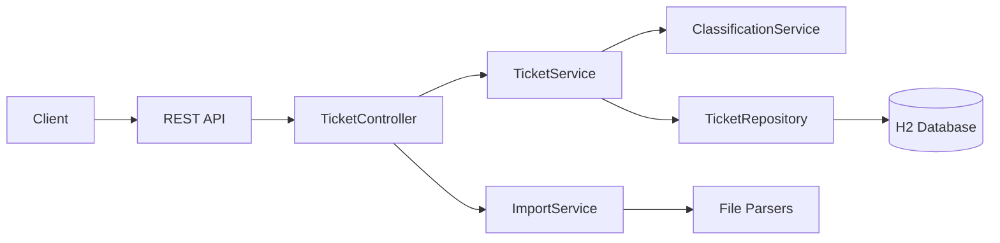
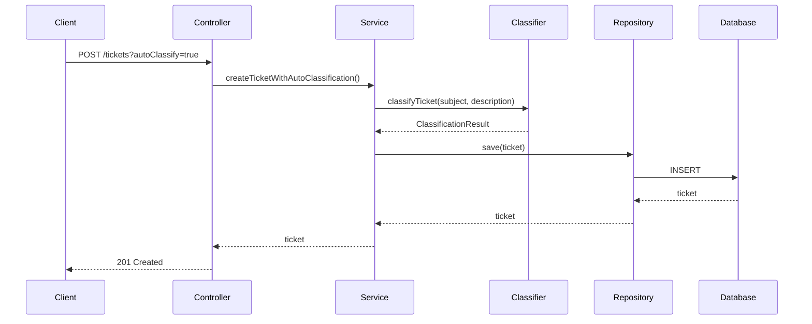
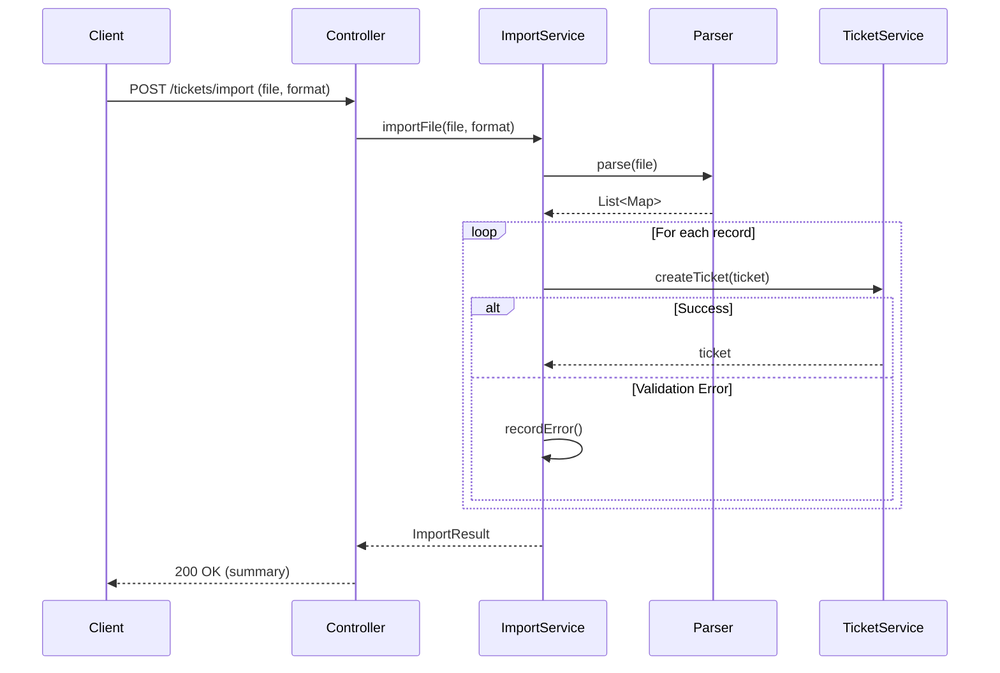
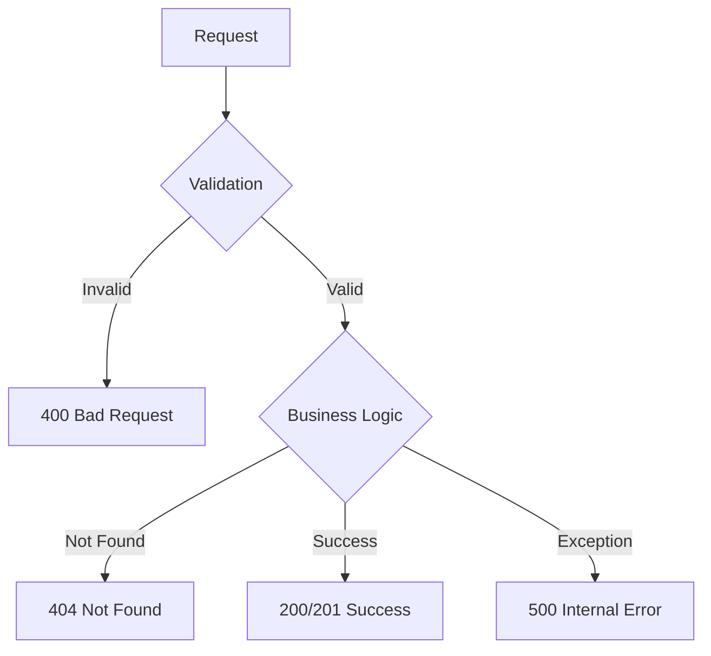

# Architecture

## System Overview

## Component Design

### Controller Layer
**Responsibility**: Handle HTTP requests/responses

- `TicketController`: All ticket-related endpoints
- `GlobalExceptionHandler`: Centralized error handling

### Service Layer
**Responsibility**: Business logic and orchestration

- `TicketService`: CRUD operations, validation
- `ClassificationService`: Auto-categorization and priority assignment
- `ImportService`: Multi-format file parsing and bulk operations

### Repository Layer
**Responsibility**: Data persistence

- `TicketRepository`: JPA interface with custom queries
- H2 in-memory database for development

### Data Transfer Objects
- `ImportResult`: Bulk import summary
- `ClassificationResult`: Classification details
- `ErrorResponse`: Error formatting

## Request Flow

## Import Flow

## Design Decisions

### 1. H2 In-Memory Database
**Choice**: H2 instead of PostgreSQL/MySQL

**Reasoning**:
- Zero configuration for development
- Fast test execution
- Easy to switch to production DB (just change config)

### 2. Keyword-Based Classification
**Choice**: Simple pattern matching vs ML model

**Reasoning**:
- Meets requirements without complexity
- Fast and deterministic
- Easy to maintain and extend
- No training data needed

**Trade-off**: Less accurate than ML but sufficient for homework scope

### 3. Synchronous Import
**Choice**: Process imports synchronously vs async job queue

**Reasoning**:
- Simpler implementation
- Immediate feedback to user
- File sizes limited to 10MB

**Trade-off**: Blocks request thread but acceptable for moderate file sizes

### 4. JPA/Hibernate
**Choice**: ORM vs raw JDBC

**Reasoning**:
- Standard Spring Boot approach
- Automatic schema generation
- Type-safe queries
- Reduces boilerplate

## Security Considerations

- Input validation on all endpoints (Bean Validation)
- Email format validation
- String length constraints prevent DoS
- No SQL injection risk (JPA parameterized queries)
- File upload size limit (10MB)

**Production TODO**:
- Add authentication/authorization
- Rate limiting on import endpoint
- HTTPS only
- Input sanitization for XSS

## Performance

### Optimizations
- Database indexes on frequently queried fields
- Batch inserts for bulk imports
- Connection pooling (HikariCP)
- Lazy loading for relationships

### Benchmarks
- Single ticket creation: <50ms
- 100 ticket import: <2s
- 20 concurrent requests: <3s total

### Scalability
**Current**: Single instance, in-memory DB

**Production scaling**:
- PostgreSQL with connection pooling
- Redis caching layer
- Load balancer for horizontal scaling
- Async queue for imports (RabbitMQ/Kafka)

## Error Handling Strategy

### Error Propagation
1. Controller validates input format
2. Service validates business rules
3. Repository handles data constraints
4. GlobalExceptionHandler catches all

This ensures clean error messages at every layer.
