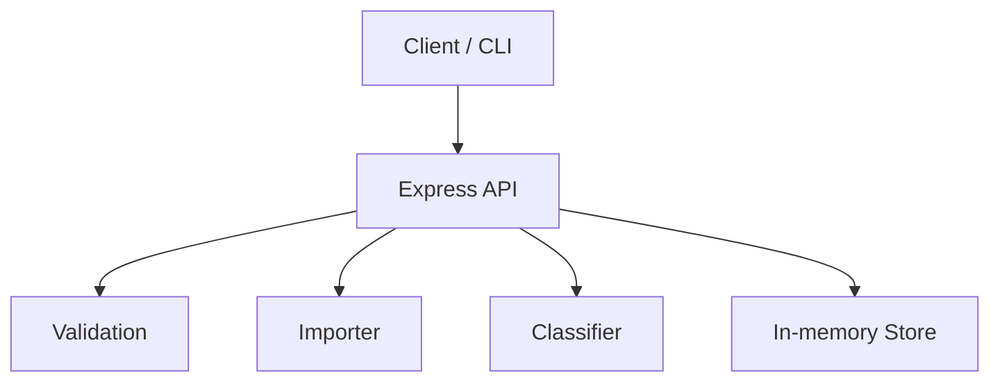
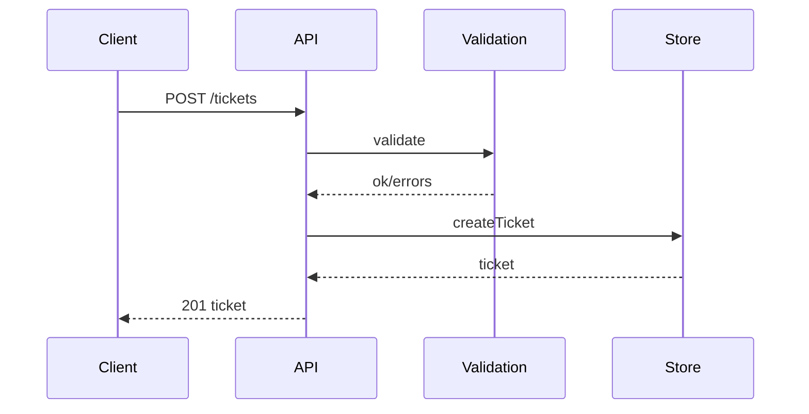
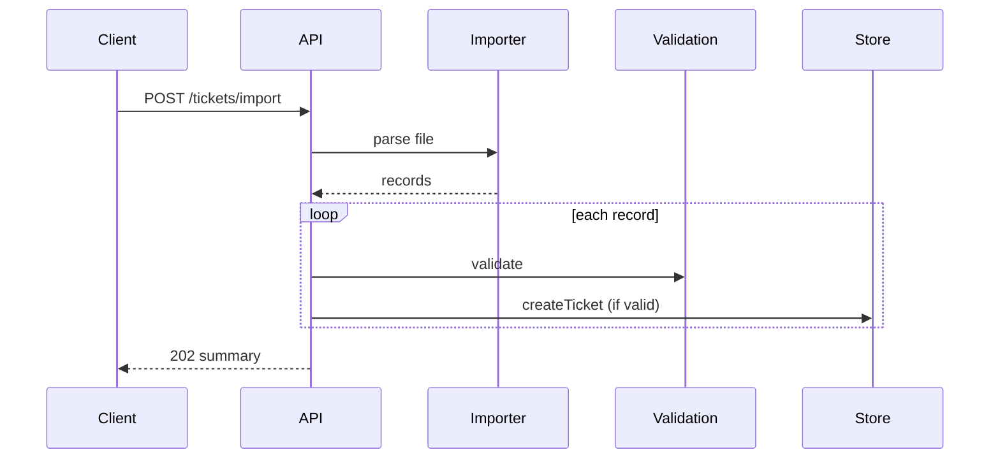

# Architecture

## High-Level View

```mermaid
graph TD
  Client[Client / CLI] --> API[Express API]
  API --> Validation[Validation]
  API --> Importer[Importer]
  API --> Classifier[Classifier]
  API --> Store[In-memory Store]
```

## Components
- `routes/tickets.js`: HTTP endpoints and status codes.
- `models/ticket.js`: Zod validation and defaults.
- `services/importer.js`: CSV/JSON/XML parsing.
- `services/classifier.js`: Keyword-based classification.
- `store.js`: In-memory CRUD and filtering.

## Data Flow (Sequence)
### Create Ticket

```mermaid
sequenceDiagram
  Client->>API: POST /tickets
  API->>Validation: validate
  Validation-->>API: ok/errors
  API->>Store: createTicket
  Store-->>API: ticket
  API-->>Client: 201 ticket
```

### Bulk Import

```mermaid
sequenceDiagram
  Client->>API: POST /tickets/import
  API->>Importer: parse file
  Importer-->>API: records
  loop each record
    API->>Validation: validate
    API->>Store: createTicket (if valid)
  end
  API-->>Client: 202 summary
```

## Design Decisions and Trade-offs
- In-memory store keeps setup simple but is not durable.
- Keyword matching is deterministic and fast but less flexible than ML.
- Synchronous parsing favors simplicity over streaming for large files.

## Security Considerations
- No authentication; intended for local/demo usage.
- Input validation on all write operations.
- Upload size limited by Multer (5 MB).

## Performance Considerations
- In-memory operations are O(n) for list filters.
- Bulk import validates each record individually.
- Auto-classification is linear in text length and keyword count.
