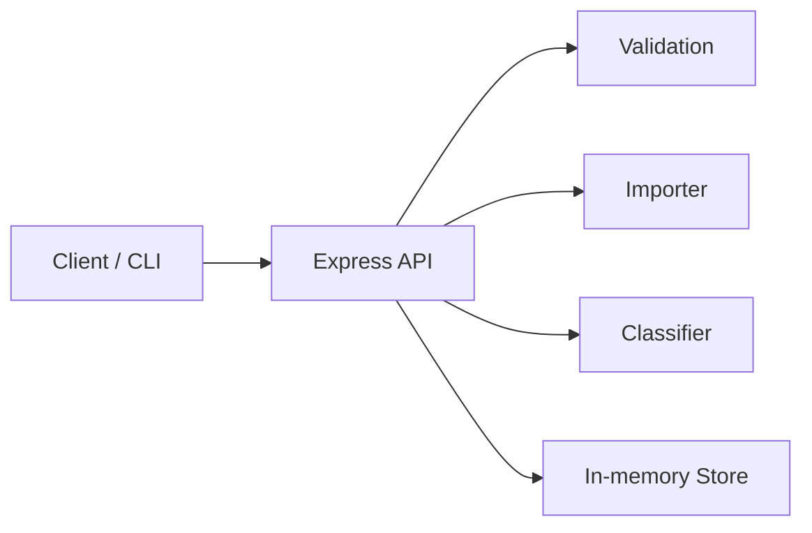

# Intelligent Customer Support System

## Overview
A ticket management API that supports multi-format imports, automatic classification, and CRUD operations with filtering.

## Key Features
- CSV/JSON/XML bulk import with validation and error summaries
- Auto-classification with confidence, reasoning, and keywords
- REST API for create, list/filter, update, delete, and classify
- In-memory store with timestamps and classification logs

## Architecture (Mermaid)


## Setup
```bash
cd homework-2
npm install
npm start
```

## Tests
```bash
npm test
npm run test:coverage
```

## Project Structure
```
homework-2/
  src/
    app.js
    server.js
    store.js
    models/ticket.js
    routes/tickets.js
    services/{classifier,importer}.js
  tests/
  sample_data/
  docs/
  demo/
```

## Documentation
- `docs/API_REFERENCE.md`
- `docs/ARCHITECTURE.md`
- `docs/TESTING_GUIDE.md`

## AI Usage
Documentation was drafted using multiple AI models and then edited for consistency.
