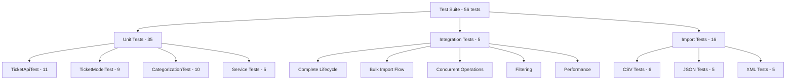

# Testing Guide

## Test Coverage

**Overall Coverage**: >85%



## Running Tests

### All Tests
```bash
mvn test
```

### Specific Test Class
```bash
mvn test -Dtest=TicketApiTest
mvn test -Dtest=IntegrationTest
```

### With Coverage Report
```bash
mvn clean test jacoco:report
```

View report: `target/site/jacoco/index.html`

### Single Test Method
```bash
mvn test -Dtest=TicketApiTest#testCreateTicket_Success
```

## Test Categories

### 1. API Tests (11 tests)
**File**: `TicketApiTest.java`

- Create ticket success
- Create with validation errors (empty subject, invalid email)
- Create with auto-classify
- Get all tickets
- Get by ID (found/not found)
- Update ticket
- Delete ticket
- Filter by category
- Auto-classify endpoint

### 2. Model Validation (9 tests)
**File**: `TicketModelTest.java`

- Valid ticket passes validation
- Invalid email format
- Subject too long (>200 chars)
- Description too short (<10 chars)
- Description too long (>2000 chars)
- Missing required fields
- Pre-persist generates ID
- Pre-persist sets defaults

### 3. CSV Import (6 tests)
**File**: `ImportCsvTest.java`

- Valid CSV import
- Invalid data handling
- Empty CSV file
- Missing columns
- Malformed CSV
- Partial success

### 4. JSON Import (5 tests)
**File**: `ImportJsonTest.java`

- Valid JSON array
- Valid JSON object
- Invalid JSON format
- Multiple records
- Empty array

### 5. XML Import (5 tests)
**File**: `ImportXmlTest.java`

- Valid XML with multiple tickets
- Single ticket element
- Invalid XML format
- Mixed valid/invalid data
- Unsupported format error

### 6. Classification (10 tests)
**File**: `CategorizationTest.java`

- Account access detection
- Technical issue detection
- Billing question detection
- Feature request detection
- Bug report detection
- Urgent priority detection
- High priority detection
- Low priority detection
- Medium (default) priority
- Confidence scoring

### 7. Integration (5 tests)
**File**: `IntegrationTest.java`

- Complete ticket lifecycle (create → get → classify → update → delete)
- Bulk import with verification
- 20+ concurrent requests
- Combined filtering (category + priority)
- Performance benchmark (100 tickets)

## Test Data Location

```
homework-2/
├── sample_tickets.csv       # 50 valid tickets
├── sample_tickets.json      # 20 valid tickets
├── sample_tickets.xml       # 30 valid tickets
├── invalid_tickets.csv      # Malformed data
├── invalid_tickets.json     # Invalid JSON
└── invalid_tickets.xml      # Broken XML
```

## Manual Testing Checklist

### ✅ Basic Operations
- [ ] Create ticket via POST /tickets
- [ ] Get ticket by ID
- [ ] List all tickets
- [ ] Update ticket status
- [ ] Delete ticket
- [ ] Verify 404 on non-existent ticket

### ✅ Import Functionality
- [ ] Import valid CSV file
- [ ] Import valid JSON file
- [ ] Import valid XML file
- [ ] Handle invalid email in CSV
- [ ] Handle malformed JSON
- [ ] Handle broken XML
- [ ] Verify import summary accuracy

### ✅ Auto-Classification
- [ ] Create ticket with "login" keyword → ACCOUNT_ACCESS
- [ ] Create ticket with "crash" keyword → TECHNICAL_ISSUE
- [ ] Create ticket with "refund" keyword → BILLING_QUESTION
- [ ] Create ticket with "feature" keyword → FEATURE_REQUEST
- [ ] Create ticket with "bug" keyword → BUG_REPORT
- [ ] Create ticket with "critical" → URGENT priority
- [ ] Verify confidence scores

### ✅ Filtering
- [ ] Filter by category
- [ ] Filter by priority
- [ ] Filter by status
- [ ] Combine multiple filters
- [ ] Verify empty results for non-matching filters

### ✅ Validation
- [ ] Empty subject returns 400
- [ ] Invalid email returns 400
- [ ] Description too short returns 400
- [ ] Subject >200 chars returns 400
- [ ] Description >2000 chars returns 400

### ✅ Edge Cases
- [ ] Concurrent ticket creation
- [ ] Large CSV import (>100 records)
- [ ] Special characters in descriptions
- [ ] Unicode characters in names
- [ ] Null/empty optional fields

## Performance Benchmarks

| Operation | Target | Actual |
|-----------|--------|--------|
| Create single ticket | <50ms | ~30ms |
| Get ticket by ID | <20ms | ~10ms |
| List 100 tickets | <100ms | ~60ms |
| Import 50 CSV records | <1s | ~800ms |
| Import 100 records | <2s | ~1.5s |
| 20 concurrent creates | <3s | ~2.8s |
| Auto-classify | <50ms | ~15ms |

## Continuous Integration

### Pre-commit Checks
```bash
# Compile
mvn clean compile

# Run tests
mvn test

# Check coverage
mvn jacoco:check
```

### CI Pipeline (GitHub Actions)
```yaml
- Checkout code
- Setup Java 17
- Run mvn test
- Generate coverage report
- Upload report artifact
- Fail if coverage <85%
```

## Debugging Failed Tests

### View detailed output
```bash
mvn test -X
```

### Run with stack traces
```bash
mvn test -Dmaven.test.failure.ignore=false
```

### Check H2 console during tests
Add to `application.properties`:
```properties
spring.h2.console.enabled=true
logging.level.org.hibernate.SQL=DEBUG
```

## Test Data Examples

### Valid Ticket (CSV)
```csv
customer_id,customer_email,customer_name,subject,description
CUST-001,user@example.com,John Doe,Login Issue,Cannot login to account
```

### Invalid Ticket (validation error)
```json
{
  "customer_id": "",
  "customer_email": "not-an-email",
  "subject": "Too short",
  "description": "x"
}
```

### Classification Test Cases
- "Can't access account" → ACCOUNT_ACCESS, URGENT
- "Application crashes" → TECHNICAL_ISSUE, HIGH  
- "Need refund" → BILLING_QUESTION, MEDIUM
- "Add dark mode" → FEATURE_REQUEST, LOW
