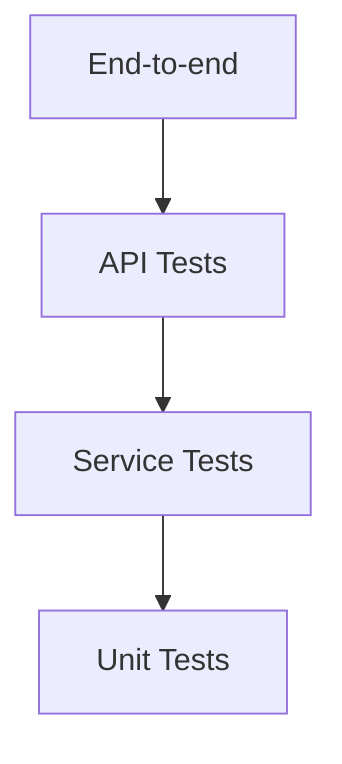

# Testing Guide

## Test Pyramid

```mermaid
flowchart TB
  E2E[End-to-end]
  API[API Tests]
  Service[Service Tests]
  Unit[Unit Tests]
  E2E --> API --> Service --> Unit
```

## Run Tests
```bash
npm test
npm run test:coverage
```

## Test Suites
- `tests/test_ticket_model.js`
- `tests/test_ticket_api.js`
- `tests/test_import_csv.js`
- `tests/test_import_json.js`
- `tests/test_import_xml.js`
- `tests/test_categorization.js`
- `tests/test_integration.js`
- `tests/test_performance.js`

## Sample Data
- `sample_data/sample_tickets.csv`
- `sample_data/sample_tickets.json`
- `sample_data/sample_tickets.xml`
- `sample_data/invalid_tickets.csv`
- `sample_data/invalid_tickets.json`

## Manual Testing Checklist
- Create, list, update, delete a ticket.
- Import CSV, JSON, and XML files.
- Verify validation errors on malformed input.
- Run auto-classify and check reasoning/keywords.
- Filter by status, category, and priority.

## Performance Benchmarks (Targets)
| Operation | Target |
|---|---|
| Create ticket | < 50 ms |
| List 50 tickets | < 100 ms |
| Import 100 records | < 500 ms |
| Auto-classify | < 100 ms |
| 20 concurrent requests | < 5 s |
