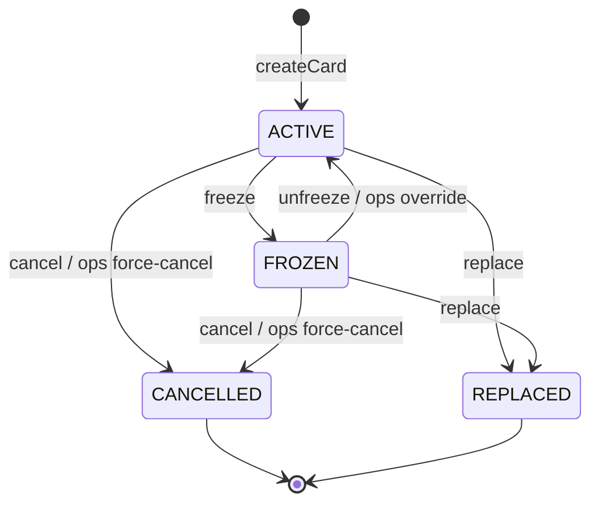

# Virtual Card Lifecycle & Spending Controls Specification

> Ingest the information from this file, implement the Low-Level Tasks in order, and generate the code that will satisfy the High and Mid-Level Objectives. Each task includes the exact prompt to run. Follow the constraints and acceptance criteria precisely. Do NOT add features, endpoints, or abstractions beyond what is specified.

---

## High-Level Objective

Build a production-grade Virtual Card Lifecycle and Spending Controls service within a Spring Boot monolith that allows end-users to create, freeze, unfreeze, and replace virtual cards with configurable spending limits, while providing internal ops/compliance personnel with audit, investigation, and override capabilities — all in a FinTech-regulated, auditable, and security-hardened manner.

---

## Mid-Level Objectives

1. **Card Lifecycle Management** — Enable end-users to create virtual cards, freeze/unfreeze them, and request replacements; enforce a strict state machine governing allowed transitions (`ACTIVE -> FROZEN -> ACTIVE`, `ACTIVE -> CANCELLED`, `FROZEN -> CANCELLED`, `ACTIVE -> REPLACED`, `FROZEN -> REPLACED`) with every transition producing an immutable audit event.

2. **Spending Controls Enforcement** — Allow end-users to set per-card spending limits (per-transaction limit, daily aggregate limit, monthly aggregate limit) denominated in a single ISO-4217 currency; the service MUST reject any transaction authorization that would breach a limit and MUST enforce limits at the service layer before any persistence.

3. **Transaction Ledger** — Record every card transaction (authorizations, settlements, declines, reversals) as append-only ledger entries with correlation IDs; support querying by card, date range, status, and amount range with pagination.

4. **Ops/Compliance Console Capabilities** — Provide internal endpoints for compliance officers to search cards across users, view full audit trails, override a freeze (with mandatory reason), force-cancel a card, and flag a card for investigation — all gated behind a separate authorization role.

5. **Security & OWASP Alignment** — Prevent the OWASP Top 10 attack classes through input validation, parameterized queries, authorization enforcement at every service method, safe error responses, structured audit logging with redaction of sensitive fields, and rate limiting.

6. **Idempotency & Concurrency Safety** — Every state-changing operation MUST accept a client-supplied idempotency key; concurrent mutations on the same card MUST be resolved via optimistic locking (version column) with a clear retry semantic.

7. **Observability & Auditability** — Every state change MUST produce a structured audit log entry containing: actor ID, actor role, action, entity type, entity ID, before-state, after-state, timestamp (UTC), correlation ID, and reason (where applicable). Audit records are append-only and MUST NOT be updated or deleted.

---

## Implementation Notes

### Architecture & Layering

> Package structure, layer dependency rules, DTO mapping, transaction boundaries, and money handling conventions are defined in [`agents.md`](agents.md) section 3 (Architecture Conventions). Read that file for all architecture conventions. This section covers only domain-specific data modeling.

### Card State Machine



**Terminal states:** CANCELLED and REPLACED have no outgoing transitions. Any attempt to transition out of a terminal state MUST throw `InvalidStateTransitionException`.

### Data Modeling Guidance

- **VirtualCard** entity: id (UUID), userId (UUID), cardToken (opaque, non-PAN), displayName, state (enum), currency (ISO-4217, 3-char), perTransactionLimit (BigDecimal), dailyLimit (BigDecimal), monthlyLimit (BigDecimal), version (long, for optimistic locking), createdAt, updatedAt, replacedByCardId (nullable UUID).
- **CardAuditEvent** entity: id (UUID), cardId (UUID), actorId (UUID), actorRole (enum), action (enum), beforeState, afterState, reason (nullable), correlationId (UUID), timestamp (Instant, UTC). This table is append-only.
- **CardTransaction** entity: id (UUID), cardId (UUID), type (enum: AUTHORIZATION, SETTLEMENT, DECLINE, REVERSAL), amount (BigDecimal), currency (ISO-4217), merchantInfo (String, max 255), status, correlationId (UUID), createdAt. Append-only.
- **SpendingAggregate** (materialized or computed): tracks daily and monthly running totals per card. Can be a DB view or computed at query time — document trade-offs. MUST use `SELECT ... FOR UPDATE` or optimistic locking when checking + updating aggregates to prevent race conditions.
- Money conventions (BigDecimal, NUMERIC(19,4), HALF_EVEN rounding, ISO-4217) are defined in `agents.md` > Key Conventions. Mixed-currency operations are NOT supported and MUST be rejected.

### Security, Validation & Error Handling

> Full details in [`security-policy.md`](security-policy.md): OWASP Top 10 mapping, domain validation constraints (field patterns, size limits, BigDecimal precision), logging redaction rules, and the complete error response contract with HTTP status code mapping. The agent MUST read that file when implementing any task that touches authorization, validation, logging, or error handling.

**Key constraints repeated here for quick reference:**
- Authorization: deny by default; enforce at service layer via `AuthorizationService`.
- Queries: parameterized only (Spring Data JPA / JPQL). No string concatenation.
- Errors outward: `ErrorResponse` envelope. NEVER leak internals. See `security-policy.md` > Error Response Contract for full status code mapping.

### Idempotency

- Every state-changing endpoint accepts an `Idempotency-Key` header (UUID).
- The service MUST store idempotency records: key, request hash, response, status, created_at, expires_at.
- If the same key arrives with the same request hash, return the stored response.
- If the same key arrives with a different request hash, return HTTP 409.
- Idempotency records expire after 24 hours.

### Rate Limiting

- End-user endpoints: 60 requests/minute per user.
- Ops/compliance endpoints: 120 requests/minute per actor.
- Rate limit state MAY be stored in-memory for the monolith (document that this would need Redis or similar in a distributed setup).

### Audit & Compliance

- Audit events are immutable: no UPDATE or DELETE on the audit table.
- Every audit event includes a correlation ID that ties it to the originating request.
- Audit query endpoint for ops: filter by cardId, userId, actorId, action type, date range. Paginated.
- Retention: document that audit data retention policy is out of scope for implementation but MUST be considered in production (minimum 7 years for financial records).

### Performance Considerations

- Card lookup by userId: indexed.
- Transaction query by cardId + createdAt: composite index.
- Audit query by cardId + timestamp: composite index.
- Spending aggregate computation: document the trade-off between real-time SUM query vs. materialized aggregate table. Recommend materialized aggregate with pessimistic lock during authorization check for consistency.

### Out of Scope

- Authentication/identity provider (assume JWT with userId and roles is provided by an external gateway).
- Card number (PAN) generation or tokenization service integration.
- Payment network integration (Visa/Mastercard).
- Notification service (email/SMS/push).
- UI/frontend.
- Multi-currency conversion.
- Batch processing or scheduled jobs (except internal cleanup, e.g., `IdempotencyService.cleanupExpired()`).
- Deployment, CI/CD pipeline configuration.

---

## Context

### Beginning Context

The following files exist before any task begins (a fresh Spring Boot project scaffolded via Spring Initializr):

```
pom.xml                                  (or build.gradle — Maven assumed)
src/main/resources/application.yml
src/main/resources/application-test.yml
src/main/java/com/levik/virtualcard/VirtualCardApplication.java
src/test/java/com/levik/virtualcard/VirtualCardApplicationTests.java
```

### Ending Context

After all tasks are complete, the following files MUST exist:

```
task.md                                  (progress tracker — maintained throughout)
pom.xml
src/main/resources/application.yml
src/main/resources/application-test.yml
src/main/resources/db/migration/V1__initial_schema.sql

src/main/java/com/levik/virtualcard/VirtualCardApplication.java

# Domain / Model
src/main/java/com/levik/virtualcard/domain/model/VirtualCard.java
src/main/java/com/levik/virtualcard/domain/model/CardState.java
src/main/java/com/levik/virtualcard/domain/model/CardTransaction.java
src/main/java/com/levik/virtualcard/domain/model/TransactionType.java
src/main/java/com/levik/virtualcard/domain/model/TransactionStatus.java
src/main/java/com/levik/virtualcard/domain/model/CardAuditEvent.java
src/main/java/com/levik/virtualcard/domain/model/AuditAction.java
src/main/java/com/levik/virtualcard/domain/model/ActorRole.java
src/main/java/com/levik/virtualcard/domain/model/SpendingAggregate.java
src/main/java/com/levik/virtualcard/domain/model/IdempotencyRecord.java

# Repository
src/main/java/com/levik/virtualcard/repository/VirtualCardRepository.java
src/main/java/com/levik/virtualcard/repository/CardTransactionRepository.java
src/main/java/com/levik/virtualcard/repository/CardAuditEventRepository.java
src/main/java/com/levik/virtualcard/repository/SpendingAggregateRepository.java
src/main/java/com/levik/virtualcard/repository/IdempotencyRecordRepository.java

# Service
src/main/java/com/levik/virtualcard/service/CardLifecycleService.java
src/main/java/com/levik/virtualcard/service/SpendingControlService.java
src/main/java/com/levik/virtualcard/service/TransactionService.java
src/main/java/com/levik/virtualcard/service/AuditService.java
src/main/java/com/levik/virtualcard/service/IdempotencyService.java
src/main/java/com/levik/virtualcard/service/AuthorizationService.java

# Controller
src/main/java/com/levik/virtualcard/controller/CardController.java
src/main/java/com/levik/virtualcard/controller/TransactionController.java
src/main/java/com/levik/virtualcard/controller/OpsController.java

# DTO
src/main/java/com/levik/virtualcard/dto/CreateCardRequest.java
src/main/java/com/levik/virtualcard/dto/CardResponse.java
src/main/java/com/levik/virtualcard/dto/UpdateSpendingLimitRequest.java
src/main/java/com/levik/virtualcard/dto/TransactionResponse.java
src/main/java/com/levik/virtualcard/dto/AuditEventResponse.java
src/main/java/com/levik/virtualcard/dto/ErrorResponse.java
src/main/java/com/levik/virtualcard/dto/OpsOverrideRequest.java

# Exception / Error Handling
src/main/java/com/levik/virtualcard/exception/GlobalExceptionHandler.java
src/main/java/com/levik/virtualcard/exception/CardNotFoundException.java
src/main/java/com/levik/virtualcard/exception/InvalidStateTransitionException.java
src/main/java/com/levik/virtualcard/exception/SpendingLimitExceededException.java
src/main/java/com/levik/virtualcard/exception/IdempotencyConflictException.java
src/main/java/com/levik/virtualcard/exception/AccessDeniedException.java

# Configuration
src/main/java/com/levik/virtualcard/config/SecurityConfig.java
src/main/java/com/levik/virtualcard/config/RateLimitConfig.java
src/main/java/com/levik/virtualcard/config/JacksonConfig.java

# Tests
src/test/java/com/levik/virtualcard/domain/model/VirtualCardTest.java
src/test/java/com/levik/virtualcard/domain/model/CardStateTransitionTest.java
src/test/java/com/levik/virtualcard/service/CardLifecycleServiceTest.java
src/test/java/com/levik/virtualcard/service/SpendingControlServiceTest.java
src/test/java/com/levik/virtualcard/service/TransactionServiceTest.java
src/test/java/com/levik/virtualcard/service/IdempotencyServiceTest.java
src/test/java/com/levik/virtualcard/controller/CardControllerIntegrationTest.java
src/test/java/com/levik/virtualcard/controller/TransactionControllerIntegrationTest.java
src/test/java/com/levik/virtualcard/controller/OpsControllerIntegrationTest.java
src/test/java/com/levik/virtualcard/security/AuthorizationIntegrationTest.java
```

---

## Low-Level Tasks

### 1. Define Domain Enums and Value Objects

**Prompt:**
> Create the domain enums and value objects for the virtual card system. Create the following enums: `CardState` with values ACTIVE, FROZEN, CANCELLED, REPLACED — include a static method `allowedTransitions(CardState from)` that returns a `Set<CardState>` of valid target states per the state machine (ACTIVE -> FROZEN, CANCELLED, REPLACED; FROZEN -> ACTIVE, CANCELLED, REPLACED; CANCELLED and REPLACED are terminal with no outgoing transitions). Create `TransactionType` (AUTHORIZATION, SETTLEMENT, DECLINE, REVERSAL), `TransactionStatus` (PENDING, COMPLETED, FAILED, REVERSED), `AuditAction` (CARD_CREATED, CARD_FROZEN, CARD_UNFROZEN, CARD_CANCELLED, CARD_REPLACED, LIMIT_UPDATED, OPS_OVERRIDE_FREEZE, OPS_FORCE_CANCEL, OPS_FLAG_INVESTIGATION, TRANSACTION_AUTHORIZED, TRANSACTION_DECLINED, TRANSACTION_SETTLED, TRANSACTION_REVERSED), and `ActorRole` (END_USER, OPS, COMPLIANCE, SYSTEM). All enums MUST be in the `com.levik.virtualcard.domain.model` package. Do NOT add any Spring annotations — these are plain Java enums.

**Files to CREATE:**
- `src/main/java/com/levik/virtualcard/domain/model/CardState.java`
- `src/main/java/com/levik/virtualcard/domain/model/TransactionType.java`
- `src/main/java/com/levik/virtualcard/domain/model/TransactionStatus.java`
- `src/main/java/com/levik/virtualcard/domain/model/AuditAction.java`
- `src/main/java/com/levik/virtualcard/domain/model/ActorRole.java`

**Classes/Functions:** `CardState` (with `allowedTransitions` method), `TransactionType`, `TransactionStatus`, `AuditAction`, `ActorRole`.

**Acceptance Criteria:**
- `CardState.allowedTransitions(ACTIVE)` returns `{FROZEN, CANCELLED, REPLACED}`.
- `CardState.allowedTransitions(CANCELLED)` returns empty set.
- `CardState.allowedTransitions(REPLACED)` returns empty set.
- All enums compile without any Spring dependency.
- Unit test `CardStateTransitionTest` validates all transitions exhaustively.

---

### 2. Create JPA Entities — VirtualCard and SpendingAggregate

**Prompt:**
> Create the `VirtualCard` JPA entity in `com.levik.virtualcard.domain.model`. Fields: id (UUID, generated), userId (UUID, not null), cardToken (String, unique, not null, max 64), displayName (String, max 100), state (CardState enum, mapped as STRING, default ACTIVE), currency (String, 3 chars, not null), perTransactionLimit (BigDecimal, NUMERIC(19,4), nullable), dailyLimit (BigDecimal, NUMERIC(19,4), nullable), monthlyLimit (BigDecimal, NUMERIC(19,4), nullable), replacedByCardId (UUID, nullable), version (long, annotated with @Version for optimistic locking), createdAt (Instant, set on persist), updatedAt (Instant, set on persist and update). Add a method `boolean canTransitionTo(CardState target)` that delegates to `CardState.allowedTransitions`. Add a method `void transitionTo(CardState target)` that throws `InvalidStateTransitionException` if the transition is not allowed. Table name: `virtual_cards`. Add index on `userId`. Also create `SpendingAggregate` entity: id (UUID), cardId (UUID, not null), aggregateDate (LocalDate, not null), dailyTotal (BigDecimal, default 0), monthlyTotal (BigDecimal, default 0), version (long, @Version). Table: `spending_aggregates`. Unique constraint on (cardId, aggregateDate).

**Files to CREATE:**
- `src/main/java/com/levik/virtualcard/domain/model/VirtualCard.java`
- `src/main/java/com/levik/virtualcard/domain/model/SpendingAggregate.java`

**Classes:** `VirtualCard`, `SpendingAggregate`.

**Acceptance Criteria:**
- `VirtualCard` has `@Version` field for optimistic locking.
- `transitionTo()` throws on invalid transitions, succeeds on valid ones.
- `createdAt`/`updatedAt` use `@PrePersist`/`@PreUpdate` callbacks.
- BigDecimal fields use `@Column(precision = 19, scale = 4)`.
- `SpendingAggregate` has unique constraint on (`cardId`, `aggregateDate`).

---

### 3. Create JPA Entities — CardTransaction, CardAuditEvent, IdempotencyRecord

**Prompt:**
> Create three JPA entities in `com.levik.virtualcard.domain.model`. (1) `CardTransaction`: id (UUID), cardId (UUID, not null), type (TransactionType, STRING), amount (BigDecimal, NUMERIC(19,4), not null), currency (String, 3 chars), merchantInfo (String, max 255), status (TransactionStatus, STRING), correlationId (UUID, not null), createdAt (Instant). Table: `card_transactions`. Index on (cardId, createdAt). (2) `CardAuditEvent`: id (UUID), cardId (UUID, not null), actorId (UUID, not null), actorRole (ActorRole, STRING), action (AuditAction, STRING), beforeState (String, nullable), afterState (String, nullable), reason (String, max 500, nullable), correlationId (UUID, not null), timestamp (Instant, not null). Table: `card_audit_events`. Index on (cardId, timestamp). This entity MUST NOT have any setter methods for id, cardId, action, or timestamp — enforce immutability. (3) `IdempotencyRecord`: id (UUID), idempotencyKey (UUID, unique, not null), requestHash (String, not null), responseBody (String/TEXT), httpStatus (int), createdAt (Instant), expiresAt (Instant). Table: `idempotency_records`. Index on idempotencyKey.

**Files to CREATE:**
- `src/main/java/com/levik/virtualcard/domain/model/CardTransaction.java`
- `src/main/java/com/levik/virtualcard/domain/model/CardAuditEvent.java`
- `src/main/java/com/levik/virtualcard/domain/model/IdempotencyRecord.java`

**Classes:** `CardTransaction`, `CardAuditEvent`, `IdempotencyRecord`.

**Acceptance Criteria:**
- `CardAuditEvent` has no setters on id, cardId, action, timestamp — use constructor or builder.
- All entities use UUID primary keys.
- `IdempotencyRecord` has unique constraint on `idempotencyKey`.
- No entity extends or references entities from other bounded contexts.

---

### 4. Create Spring Data JPA Repositories

**Prompt:**
> Create Spring Data JPA repository interfaces in `com.levik.virtualcard.repository`. (1) `VirtualCardRepository extends JpaRepository<VirtualCard, UUID>` — add `List<VirtualCard> findByUserId(UUID userId)`, `Optional<VirtualCard> findByIdAndUserId(UUID id, UUID userId)`, `List<VirtualCard> findByState(CardState state)`. (2) `CardTransactionRepository extends JpaRepository<CardTransaction, UUID>` — add a method for finding transactions by cardId with pagination, and by cardId and createdAt between two Instants. (3) `CardAuditEventRepository extends JpaRepository<CardAuditEvent, UUID>` — add methods for finding by cardId (paginated), by actorId, and by cardId + action + timestamp range. (4) `SpendingAggregateRepository extends JpaRepository<SpendingAggregate, UUID>` — add `Optional<SpendingAggregate> findByCardIdAndAggregateDate(UUID cardId, LocalDate date)`. (5) `IdempotencyRecordRepository extends JpaRepository<IdempotencyRecord, UUID>` — add `Optional<IdempotencyRecord> findByIdempotencyKey(UUID key)`, and a method to delete records where expiresAt is before a given Instant. All queries MUST use Spring Data derived query methods or @Query with JPQL (no native SQL). Queries MUST NOT use string concatenation.

**Files to CREATE:**
- `src/main/java/com/levik/virtualcard/repository/VirtualCardRepository.java`
- `src/main/java/com/levik/virtualcard/repository/CardTransactionRepository.java`
- `src/main/java/com/levik/virtualcard/repository/CardAuditEventRepository.java`
- `src/main/java/com/levik/virtualcard/repository/SpendingAggregateRepository.java`
- `src/main/java/com/levik/virtualcard/repository/IdempotencyRecordRepository.java`

**Acceptance Criteria:**
- All repositories are interfaces (not classes).
- No native SQL queries.
- All parameterized — no string concatenation.
- Pagination support via `Pageable` parameter where specified.

---

### 5. Create Flyway Migration Script

**Prompt:**
> Create the initial Flyway migration `V1__initial_schema.sql` in `src/main/resources/db/migration/`. Define tables: `virtual_cards` (all columns matching the VirtualCard entity, with `state` as VARCHAR(20), currency as CHAR(3), BigDecimal columns as NUMERIC(19,4), `version` as BIGINT default 0, timestamps as `TIMESTAMP WITH TIME ZONE`, primary key on id), `spending_aggregates` (unique constraint on cardId + aggregateDate, version column), `card_transactions` (all columns, index on cardId + createdAt), `card_audit_events` (all columns, index on cardId + timestamp), `idempotency_records` (unique on idempotencyKey, index on expiresAt). Add index on `virtual_cards.user_id`. All UUID columns as `UUID` type (PostgreSQL native). All foreign key decisions: do NOT use foreign keys between tables — use application-level referential integrity (document this decision as a FinTech pattern for allowing independent table maintenance and avoiding cascading lock issues). Add a comment at the top of the migration explaining the schema design decisions.

**Files to CREATE:**
- `src/main/resources/db/migration/V1__initial_schema.sql`

**Acceptance Criteria:**
- All tables match entity definitions.
- No foreign keys (documented decision).
- Indexes on: `virtual_cards(user_id)`, `card_transactions(card_id, created_at)`, `card_audit_events(card_id, timestamp)`, `idempotency_records(idempotency_key)`, `idempotency_records(expires_at)`.
- Unique constraint on `spending_aggregates(card_id, aggregate_date)`.
- Unique constraint on `virtual_cards(card_token)`.
- All timestamp columns use `TIMESTAMP WITH TIME ZONE`.

---

### 6. Create DTOs with Jakarta Bean Validation

**Prompt:**
> Create request/response DTOs as Java records in `com.levik.virtualcard.dto`. (1) `CreateCardRequest`: displayName (@NotBlank, @Size(max=100), @Pattern for alphanumeric+spaces+hyphens), currency (@NotBlank, @Size(min=3,max=3), @Pattern for uppercase letters), perTransactionLimit (@DecimalMin("0"), @Digits(integer=15,fraction=4), nullable), dailyLimit (same constraints, nullable), monthlyLimit (same constraints, nullable). (2) `UpdateSpendingLimitRequest`: perTransactionLimit, dailyLimit, monthlyLimit — all with same constraints, all nullable but at least one must be non-null (add a custom class-level validator or document that the service will check). (3) `CardResponse`: id, displayName, state, currency, perTransactionLimit, dailyLimit, monthlyLimit, createdAt, updatedAt — NO cardToken field (never expose tokens in responses). (4) `TransactionResponse`: id, cardId, type, amount, currency, merchantInfo, status, createdAt. (5) `AuditEventResponse`: id, cardId, actorId, actorRole, action, beforeState, afterState, reason, correlationId, timestamp. (6) `ErrorResponse`: errorCode (String), message (String), correlationId (UUID), timestamp (Instant), fieldErrors (List, nullable). (7) `OpsOverrideRequest`: reason (@NotBlank, @Size(min=1, max=500)). All records MUST use Jakarta Bean Validation annotations. No record MUST expose cardToken or any secret field.

**Files to CREATE:**
- `src/main/java/com/levik/virtualcard/dto/CreateCardRequest.java`
- `src/main/java/com/levik/virtualcard/dto/UpdateSpendingLimitRequest.java`
- `src/main/java/com/levik/virtualcard/dto/CardResponse.java`
- `src/main/java/com/levik/virtualcard/dto/TransactionResponse.java`
- `src/main/java/com/levik/virtualcard/dto/AuditEventResponse.java`
- `src/main/java/com/levik/virtualcard/dto/ErrorResponse.java`
- `src/main/java/com/levik/virtualcard/dto/OpsOverrideRequest.java`

**Acceptance Criteria:**
- All DTOs are Java records (immutable).
- `CardResponse` does NOT contain a `cardToken` field.
- Validation annotations cover all constraints from `security-policy.md` > Domain Validation Constraints.
- BigDecimal fields have `@Digits` annotation matching NUMERIC(19,4).

---

### 7. Create Custom Exceptions and Global Exception Handler

**Prompt:**
> Create custom exception classes in `com.levik.virtualcard.exception`: `CardNotFoundException` (extends RuntimeException), `InvalidStateTransitionException`, `SpendingLimitExceededException`, `IdempotencyConflictException`, `AccessDeniedException`. Each exception MUST carry a correlationId (UUID) and a user-safe message. Then create `GlobalExceptionHandler` annotated with `@RestControllerAdvice` that maps: `CardNotFoundException` -> 404, `InvalidStateTransitionException` -> 409, `SpendingLimitExceededException` -> 422, `IdempotencyConflictException` -> 409, `AccessDeniedException` -> 403, `MethodArgumentNotValidException` -> 400 (with field-level errors), `OptimisticLockingFailureException` -> 409 (with retry hint), generic `Exception` -> 500. Every error response MUST use the `ErrorResponse` DTO. NEVER include stack traces, SQL errors, or internal class names in the response body. Log the full exception internally at WARN or ERROR level with the correlation ID.

**Files to CREATE:**
- `src/main/java/com/levik/virtualcard/exception/CardNotFoundException.java`
- `src/main/java/com/levik/virtualcard/exception/InvalidStateTransitionException.java`
- `src/main/java/com/levik/virtualcard/exception/SpendingLimitExceededException.java`
- `src/main/java/com/levik/virtualcard/exception/IdempotencyConflictException.java`
- `src/main/java/com/levik/virtualcard/exception/AccessDeniedException.java`
- `src/main/java/com/levik/virtualcard/exception/GlobalExceptionHandler.java`

**Acceptance Criteria:**
- No exception leaks internal details in its user-facing message.
- `GlobalExceptionHandler` returns `ErrorResponse` for every mapped exception type.
- Correlation ID is present in every error response.
- Internal log line includes full stack trace + correlation ID.
- `MethodArgumentNotValidException` handler returns field-level validation errors.

---

### 8. Implement IdempotencyService

**Prompt:**
> Create `IdempotencyService` in `com.levik.virtualcard.service`. This service provides two operations: (1) `check(UUID idempotencyKey, String requestHash)` — looks up the idempotency key in the repository; if found and the request hash matches, return the stored response (as an `Optional<IdempotencyRecord>`); if found but hash differs, throw `IdempotencyConflictException`; if not found, return empty. (2) `record(UUID idempotencyKey, String requestHash, String responseBody, int httpStatus)` — persist a new `IdempotencyRecord` with expiresAt = now + 24 hours. The service MUST be `@Transactional`. The request hash SHOULD be computed as SHA-256 of the serialized request body (provide a static utility method `computeHash(String body)` in the service). Also add a `@Scheduled` method `cleanupExpired()` that deletes records past their `expiresAt`. Document that in a distributed system this would require a distributed lock.

**Files to CREATE:**
- `src/main/java/com/levik/virtualcard/service/IdempotencyService.java`

**Classes/Functions:** `IdempotencyService.check()`, `IdempotencyService.record()`, `IdempotencyService.computeHash()`, `IdempotencyService.cleanupExpired()`.

**Acceptance Criteria:**
- Duplicate key + same hash returns stored response.
- Duplicate key + different hash throws `IdempotencyConflictException`.
- New key returns empty.
- `cleanupExpired()` deletes only expired records.
- SHA-256 hash is deterministic and uses UTF-8 encoding.
- Unit test `IdempotencyServiceTest` covers all three cases plus cleanup.

---

### 9. Implement AuthorizationService

**Prompt:**
> Create `AuthorizationService` in `com.levik.virtualcard.service`. This service enforces access control. It receives the current actor's userId (UUID) and role (ActorRole) — assume these are extracted from the JWT by a filter and available via a `SecurityContext` holder or method parameter. Provide these methods: (1) `assertCardOwner(UUID actorUserId, VirtualCard card)` — throws `AccessDeniedException` if `actorUserId != card.getUserId()`. (2) `assertOpsOrCompliance(ActorRole role)` — throws `AccessDeniedException` if role is not OPS or COMPLIANCE. (3) `assertCanViewCard(UUID actorUserId, ActorRole role, VirtualCard card)` — end-users can view their own cards; OPS/COMPLIANCE can view any card. Deny by default. The service MUST log every authorization decision at DEBUG level (without logging sensitive data like tokens). On denial, log at WARN level with actor ID, attempted resource, and action.

**Files to CREATE:**
- `src/main/java/com/levik/virtualcard/service/AuthorizationService.java`

**Classes/Functions:** `AuthorizationService.assertCardOwner()`, `AuthorizationService.assertOpsOrCompliance()`, `AuthorizationService.assertCanViewCard()`.

**Acceptance Criteria:**
- End-user accessing own card: allowed.
- End-user accessing other user's card: `AccessDeniedException`.
- OPS accessing any card: allowed.
- Deny-by-default: if no rule matches, deny.
- WARN log on every denial (includes actorId, resource, but not token).

---

### 10. Implement AuditService

**Prompt:**
> Create `AuditService` in `com.levik.virtualcard.service`. This service is responsible for recording immutable audit events. Provide: (1) `record(UUID cardId, UUID actorId, ActorRole actorRole, AuditAction action, String beforeState, String afterState, String reason, UUID correlationId)` — creates and persists a `CardAuditEvent` with timestamp = Instant.now(Clock) (inject a `Clock` for testability). This method MUST be `@Transactional(propagation = REQUIRES_NEW)` so audit persistence is not rolled back if the outer transaction fails. (2) `findByCard(UUID cardId, Pageable pageable)` — returns paginated audit events for a card. (3) `findByFilters(UUID cardId, UUID actorId, AuditAction action, Instant from, Instant to, Pageable pageable)` — for ops/compliance queries. The `record` method MUST use structured logging to also emit an INFO-level log line with all audit fields (except redact any field matching *token* or *secret* patterns). NEVER log raw card tokens.

**Files to CREATE:**
- `src/main/java/com/levik/virtualcard/service/AuditService.java`

**Classes/Functions:** `AuditService.record()`, `AuditService.findByCard()`, `AuditService.findByFilters()`.

**Acceptance Criteria:**
- Audit records are persisted even if the calling transaction rolls back (`REQUIRES_NEW`).
- Clock is injected (not `Instant.now()` directly) for testability.
- Structured log line contains: actorId, actorRole, action, cardId, correlationId, timestamp.
- No log line contains cardToken or secret values.
- Query methods return paginated results.

---

### 11. Implement CardLifecycleService

**Prompt:**
> Create `CardLifecycleService` in `com.levik.virtualcard.service`. This is the core service for card lifecycle management. Inject `VirtualCardRepository`, `AuditService`, `AuthorizationService`, `IdempotencyService`, and a `Clock`. Implement: (1) `createCard(UUID userId, CreateCardRequest request, UUID idempotencyKey, UUID correlationId)` — check idempotency, create a `VirtualCard` with state=ACTIVE, generate a random card token (UUID-based opaque string), persist, record audit event (CARD_CREATED), return the card. (2) `freezeCard(UUID cardId, UUID actorUserId, ActorRole role, UUID idempotencyKey, UUID correlationId)` — load card, assert ownership or ops role, validate transition to FROZEN, update state, persist (optimistic lock), record audit. (3) `unfreezeCard(...)` — same pattern, transition FROZEN -> ACTIVE. (4) `cancelCard(UUID cardId, UUID actorUserId, ActorRole role, String reason, UUID idempotencyKey, UUID correlationId)` — transition to CANCELLED, reason is required. (5) `replaceCard(UUID cardId, UUID actorUserId, ActorRole role, UUID idempotencyKey, UUID correlationId)` — assert ownership or ops role, transition old card to REPLACED, create a new ACTIVE card with the same limits and currency, set old card's `replacedByCardId` to new card's ID, audit both events, return the new card. (6) `getCard(UUID cardId, UUID actorUserId, ActorRole role)` — load and authorize view. (7) `getUserCards(UUID userId)` — return cards for a user. All methods MUST be `@Transactional`. All methods MUST produce audit events. On `OptimisticLockException`, let it propagate to the global handler (which returns 409).

**Files to CREATE:**
- `src/main/java/com/levik/virtualcard/service/CardLifecycleService.java`

**Classes/Functions:** `createCard()`, `freezeCard()`, `unfreezeCard()`, `cancelCard()`, `replaceCard()`, `getCard()`, `getUserCards()`.

**Acceptance Criteria:**
- State machine enforced: freeze an already-frozen card returns error.
- Optimistic lock version increments on each update.
- `replaceCard` produces two audit events (old card REPLACED, new card CREATED).
- Card token is never returned in any method signature — only `CardResponse` DTO is returned by the controller, and it has no token field.
- Idempotency check happens before any business logic.
- Every method emits at least one audit event.
- Unit test `CardLifecycleServiceTest` covers: create, freeze, unfreeze, cancel, replace, double-freeze error, freeze-cancelled error.

---

### 12. Implement SpendingControlService

**Prompt:**
> Create `SpendingControlService` in `com.levik.virtualcard.service`. Inject `VirtualCardRepository`, `SpendingAggregateRepository`, `AuditService`, `AuthorizationService`. Implement: (1) `updateLimits(UUID cardId, UUID actorUserId, UpdateSpendingLimitRequest request, UUID idempotencyKey, UUID correlationId)` — load card, assert ownership, validate card is ACTIVE, update the non-null limit fields on the card entity, persist, audit (LIMIT_UPDATED, before/after state should include the old and new limit values). (2) `authorizeSpending(UUID cardId, BigDecimal amount, UUID correlationId)` — load card, assert card is ACTIVE, check per-transaction limit (if set), load or create today's SpendingAggregate, check daily limit (dailyTotal + amount <= dailyLimit), check monthly limit (monthlyTotal + amount <= monthlyLimit). If any check fails, throw `SpendingLimitExceededException` with a message indicating which limit was breached (but not the actual limit value — that would be information leakage to a merchant context; document this decision). If all pass, update the aggregate totals and persist. Use `@Transactional` with `@Lock(PESSIMISTIC_WRITE)` on the aggregate fetch (or document the alternative: optimistic lock with retry). (3) `getAggregates(UUID cardId, LocalDate date)` — return the spending aggregate for a card on a date.

**Files to CREATE:**
- `src/main/java/com/levik/virtualcard/service/SpendingControlService.java`

**Classes/Functions:** `updateLimits()`, `authorizeSpending()`, `getAggregates()`.

**Acceptance Criteria:**
- Per-transaction limit checked before aggregate limits.
- Aggregate totals updated atomically (pessimistic lock or documented optimistic retry).
- Limit breach throws `SpendingLimitExceededException` — message does NOT leak the actual limit amount.
- Null limits mean "no limit" — skip that check.
- Updating limits on a non-ACTIVE card throws `InvalidStateTransitionException`.
- Audit event records old and new limit values.
- Unit test `SpendingControlServiceTest` covers: limit update, authorize under limit, authorize at exact limit, authorize over per-transaction, over daily, over monthly, null limit skip.

---

### 13. Implement TransactionService

**Prompt:**
> Create `TransactionService` in `com.levik.virtualcard.service`. Inject `CardTransactionRepository`, `SpendingControlService`, `AuditService`, `AuthorizationService`, `VirtualCardRepository`. Implement: (1) `authorizeTransaction(UUID cardId, BigDecimal amount, String currency, String merchantInfo, UUID actorUserId, UUID idempotencyKey, UUID correlationId)` — load card, assert ownership, assert card is ACTIVE, assert currency matches card currency (reject if mismatch), wrap the call to `SpendingControlService.authorizeSpending` in a try/catch for `SpendingLimitExceededException`. If the call succeeds, create `CardTransaction` with type=AUTHORIZATION and status=PENDING, persist, audit (TRANSACTION_AUTHORIZED). If it throws `SpendingLimitExceededException`, catch it explicitly, create a DECLINE transaction instead, audit (TRANSACTION_DECLINED), and return the decline response as a normal 200 (do not re-throw — this is a business response, not an error). (2) `settleTransaction(UUID transactionId, UUID correlationId)` — load the PENDING authorization, change status to COMPLETED, audit (TRANSACTION_SETTLED). (3) `reverseTransaction(UUID transactionId, UUID correlationId)` — load transaction, create a REVERSAL entry, update the original to REVERSED, adjust spending aggregates (subtract the amount), audit (TRANSACTION_REVERSED). (4) `getTransactions(UUID cardId, UUID actorUserId, ActorRole role, Instant from, Instant to, Pageable pageable)` — authorize then query. All methods `@Transactional`.

**Files to CREATE:**
- `src/main/java/com/levik/virtualcard/service/TransactionService.java`

**Classes/Functions:** `authorizeTransaction()`, `settleTransaction()`, `reverseTransaction()`, `getTransactions()`.

**Acceptance Criteria:**
- Currency mismatch returns an error (not a decline).
- Declined transactions are recorded (not just thrown as exceptions).
- Reversal adjusts spending aggregates downward.
- Settle only works on PENDING transactions.
- Reversal only works on COMPLETED transactions.
- Pagination works correctly.
- Unit test `TransactionServiceTest` covers: authorize success, authorize decline (over limit), settle, reverse, currency mismatch, settle non-pending error.

---

### 14. Implement CardController (End-User Endpoints)

**Prompt:**
> Create `CardController` in `com.levik.virtualcard.controller`, annotated with `@RestController` and `@RequestMapping`. This controller handles end-user card operations. Inject `CardLifecycleService` and `SpendingControlService`. The current user's ID and role MUST be extracted from the security context (assume a helper or `@AuthenticationPrincipal`). Endpoints: (1) Create card — accepts `CreateCardRequest` with `@Valid`, `Idempotency-Key` header; returns 201 with `CardResponse`. (2) Get user's cards — returns list of `CardResponse`. (3) Get single card by ID — returns `CardResponse`. (4) Freeze card — accepts `Idempotency-Key`; returns 200 with updated `CardResponse`. (5) Unfreeze card — same pattern. (6) Cancel card — accepts reason in request body + `Idempotency-Key`; returns 200. (7) Replace card — accepts `Idempotency-Key`; returns 201 with new `CardResponse`. (8) Update spending limits — accepts `UpdateSpendingLimitRequest` with `@Valid` + `Idempotency-Key`; returns 200. Service methods MUST return DTOs (not entities) — the controller passes them through. NEVER return entities from the controller. Generate a `correlationId` (UUID) at the start of each request and pass it downstream. Add `@Validated` on the class. All request bodies annotated with `@Valid`.

**Files to CREATE:**
- `src/main/java/com/levik/virtualcard/controller/CardController.java`

**Acceptance Criteria:**
- No business logic in the controller.
- All responses use DTO records, never entities.
- `Idempotency-Key` header is required on all mutating endpoints.
- Correlation ID is generated per request and returned in the response header.
- `@Valid` on all request bodies.
- HTTP status codes: 201 for create/replace, 200 for updates/queries, error codes per GlobalExceptionHandler.
- Integration test `CardControllerIntegrationTest` covers all endpoints with valid/invalid inputs.

---

### 15. Implement TransactionController

**Prompt:**
> Create `TransactionController` in `com.levik.virtualcard.controller`. Inject `TransactionService`. Endpoints: (1) Authorize transaction on a card — accepts card ID, amount, currency, merchantInfo in request body with validation, `Idempotency-Key` header; returns 200 with `TransactionResponse` (either authorized or declined — the caller inspects the status field). (2) Settle transaction — accepts transaction ID + `Idempotency-Key`; returns 200. (3) Reverse transaction — accepts transaction ID + `Idempotency-Key`; returns 200. (4) Get transactions for a card — accepts card ID, optional date range, pagination params; returns paginated `TransactionResponse`. Correlation ID generated per request. All mutation endpoints require `Idempotency-Key`. Service methods return DTOs — the controller passes them through.

**Files to CREATE:**
- `src/main/java/com/levik/virtualcard/controller/TransactionController.java`

**Acceptance Criteria:**
- Decline is a 200 with `type=DECLINE` in the `TransactionResponse` (not a 4xx error).
- Pagination defaults: page=0, size=20, max size=100.
- All responses are DTOs.
- Integration test `TransactionControllerIntegrationTest` covers authorize, decline, settle, reverse, pagination.

---

### 16. Implement OpsController (Compliance/Internal Endpoints)

**Prompt:**
> Create `OpsController` in `com.levik.virtualcard.controller`, mapped under a separate base path (e.g., conceptually `/ops/...`). This controller is for OPS and COMPLIANCE roles only. Inject `CardLifecycleService`, `AuditService`, `AuthorizationService`. Endpoints: (1) Search cards — accepts optional filters (userId, state), pagination; returns list of `CardResponse`. Authorization: assert OPS or COMPLIANCE role. (2) Get card audit trail — accepts card ID, optional date range, pagination; returns paginated `AuditEventResponse`. (3) Override freeze (force-unfreeze a card) — accepts card ID + `OpsOverrideRequest` (with mandatory reason) + `Idempotency-Key`; returns updated `CardResponse`. Audit action: OPS_OVERRIDE_FREEZE. (4) Force cancel card — accepts card ID + `OpsOverrideRequest` + `Idempotency-Key`; returns 200. Audit action: OPS_FORCE_CANCEL. (5) Flag card for investigation — accepts card ID + `OpsOverrideRequest` + `Idempotency-Key`; returns 200. This creates an audit event OPS_FLAG_INVESTIGATION but does NOT change card state (it is a marker for investigation workflows). All endpoints MUST call `AuthorizationService.assertOpsOrCompliance()` before any business logic. Correlation ID per request.

**Files to CREATE:**
- `src/main/java/com/levik/virtualcard/controller/OpsController.java`

**Acceptance Criteria:**
- All endpoints reject non-OPS/non-COMPLIANCE callers with 403.
- Override reason is mandatory and appears in audit event.
- Force-cancel works from any non-terminal state.
- Flag-for-investigation does NOT change card state.
- Audit trail query supports date range filtering.
- Integration test `OpsControllerIntegrationTest` covers access control, override, force-cancel, flag, audit query.

---

### 17. Create Configuration Classes (Security, Rate Limiting, Jackson)

**Prompt:**
> Create three configuration classes. (1) `SecurityConfig` in `com.levik.virtualcard.config` — `@Configuration` class that sets up Spring Security. Assume JWT authentication is handled by an external filter; configure authorization rules: ops endpoints require OPS or COMPLIANCE role, all other card/transaction endpoints require authentication, actuator health is public, all other actuator endpoints are restricted. Disable CSRF (REST API). Do NOT use wildcard CORS — configure allowed origins from application property. (2) `RateLimitConfig` — configure an in-memory rate limiter (document that Bucket4j or a similar library should be used). Define rate limit constants: 60 req/min for end-users, 120 req/min for ops. Create a `HandlerInterceptor` that checks the rate limit before each request and returns 429 with `Retry-After` header if exceeded. (3) `JacksonConfig` — configure Jackson ObjectMapper: use ISO-8601 dates, do NOT serialize null fields, register JavaTimeModule, set `BigDecimal` to write as plain string (not scientific notation).

**Files to CREATE:**
- `src/main/java/com/levik/virtualcard/config/SecurityConfig.java`
- `src/main/java/com/levik/virtualcard/config/RateLimitConfig.java`
- `src/main/java/com/levik/virtualcard/config/JacksonConfig.java`

**Acceptance Criteria:**
- No wildcard CORS (`*`).
- CSRF disabled.
- Rate limiter returns 429 with `Retry-After`.
- Jackson serializes `Instant` as ISO-8601 string.
- BigDecimal never renders in scientific notation.

---

### 18. Create Tests — Unit and Integration

**Prompt:**
> Create the following test classes. UNIT TESTS (use JUnit 5, Mockito, AssertJ): (1) `VirtualCardTest` — test `canTransitionTo` and `transitionTo` for all valid and invalid transitions. (2) `CardStateTransitionTest` — exhaustively test `CardState.allowedTransitions` for every state. (3) `CardLifecycleServiceTest` — mock repository, audit service, auth service; test create, freeze, unfreeze, cancel, replace, invalid transition errors, authorization denial. (4) `SpendingControlServiceTest` — test limit update, authorize under/at/over each limit type, null limit behavior. (5) `TransactionServiceTest` — test authorize success, authorize decline, settle, reverse, currency mismatch. (6) `IdempotencyServiceTest` — test same key+same hash, same key+different hash, new key, cleanup. INTEGRATION TESTS (use `@SpringBootTest`, `@AutoConfigureMockMvc`, Testcontainers for PostgreSQL conceptually): (7) `CardControllerIntegrationTest` — test all card endpoints with MockMvc, valid and invalid inputs, authorization. (8) `TransactionControllerIntegrationTest` — test authorize, settle, reverse, pagination. (9) `OpsControllerIntegrationTest` — test access control (end-user rejected, ops allowed), override, force-cancel, flag, audit query. (10) `AuthorizationIntegrationTest` — test that end-user cannot access ops endpoints, ops cannot be impersonated, deny-by-default works. Each test class MUST follow the pattern: Arrange (given), Act (when), Assert (then). Use `@DisplayName` for readable test names. Integration tests MUST use Testcontainers PostgreSQL (not H2).

**Files to CREATE:**
- `src/test/java/com/levik/virtualcard/domain/model/VirtualCardTest.java`
- `src/test/java/com/levik/virtualcard/domain/model/CardStateTransitionTest.java`
- `src/test/java/com/levik/virtualcard/service/CardLifecycleServiceTest.java`
- `src/test/java/com/levik/virtualcard/service/SpendingControlServiceTest.java`
- `src/test/java/com/levik/virtualcard/service/TransactionServiceTest.java`
- `src/test/java/com/levik/virtualcard/service/IdempotencyServiceTest.java`
- `src/test/java/com/levik/virtualcard/controller/CardControllerIntegrationTest.java`
- `src/test/java/com/levik/virtualcard/controller/TransactionControllerIntegrationTest.java`
- `src/test/java/com/levik/virtualcard/controller/OpsControllerIntegrationTest.java`
- `src/test/java/com/levik/virtualcard/security/AuthorizationIntegrationTest.java`

**Acceptance Criteria:**
- All unit tests use Mockito for dependencies.
- All integration tests use `@SpringBootTest` + Testcontainers PostgreSQL.
- Test naming follows `@DisplayName("should [expected behavior] when [condition]")`.
- Each test method follows Given/When/Then structure.
- No test depends on execution order.
- Edge cases covered: empty limits, boundary values, concurrent modification (optimistic lock failure simulation).
- Minimum test count: 6 unit tests per service test class, 4 integration tests per controller test class.
