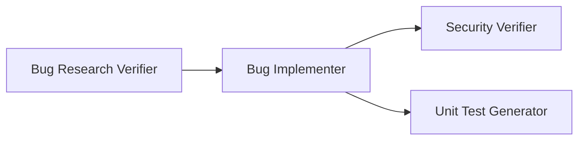

# PR Summary — Homework 4: 4-Agent Bug Fixing Pipeline

**Student**: Yevgen Polukov
**Branch**: `homework-4`
**Course**: AI Coding Partner / Multi-Agent Systems

---

## What This PR Delivers

A complete **4-agent bug fixing pipeline** applied end-to-end to a real Node.js/Express bug (`API-404`).

---

## The Bug Fixed

**API-404** — `GET /api/users/:id` returned 404 for all valid user IDs.

**Root cause**: `req.params.id` is always a string (`"123"`), but user IDs in the array are numbers (`123`). Strict equality `===` always failed.

**Fix** in `demo-bug-fix/src/controllers/userController.js`:
```js
// Before (buggy)
const userId = req.params.id;

// After (fixed)
const userId = parseInt(req.params.id, 10);
if (isNaN(userId)) {
  return res.status(400).json({ error: 'Invalid user ID' });
}
```

---

## Pipeline Architecture



**Run order**: Bug Researcher → Bug Research Verifier → Bug Planner → Bug Implementer → Security Verifier → Unit Test Generator

---

## Agents Implemented

| Agent | File | Output |
|-------|------|--------|
| Bug Research Verifier | `agents/research-verifier.agent.md` | `verified-research.md` |
| Bug Implementer | `agents/bug-implementer.agent.md` | `fix-summary.md` + code changes |
| Security Verifier | `agents/security-verifier.agent.md` | `security-report.md` |
| Unit Test Generator | `agents/unit-test-generator.agent.md` | `test-report.md` + test file |

## Skills Implemented

| Skill | Purpose |
|-------|---------|
| `skills/research-quality-measurement.md` | 5-dimension rubric (EXCELLENT / GOOD / PARTIAL / WEAK / FAIL) used by Research Verifier |
| `skills/unit-tests-FIRST.md` | Fast / Independent / Repeatable / Self-validating / Timely checklist used by Unit Test Generator |

---

## Pipeline Run Results

| Agent | Result | Details |
|-------|--------|---------|
| Research Verifier | ✅ PASS | EXCELLENT quality, 92/100, 4/4 references verified |
| Bug Implementer | ✅ SUCCESS | Fix applied, 5/5 tests pass |
| Security Verifier | ✅ PASS WITH NOTES | 0 critical, 0 high, 2 low, 3 info |
| Unit Test Generator | ✅ PASS | 5/5 tests, FIRST fully compliant, 0.207s |

---

## Test Results

```
PASS tests/userController.test.js
  getUserById
    ✓ returns user object with 200 when numeric ID matches
    ✓ returns 404 when user ID does not exist
    ✓ REGRESSION: string "123" now correctly finds user (before fix this would 404)
    ✓ returns 400 for non-numeric string ID
    ✓ returns 400 for empty string ID

Tests: 5 passed, 5 total — Time: 0.207s
```

---

## API Verification

| Request | HTTP | Response |
|---------|------|----------|
| `GET /api/users/123` | 200 | `{"id":123,"name":"Alice Smith","email":"alice@example.com"}` |
| `GET /api/users/456` | 200 | `{"id":456,"name":"Bob Johnson","email":"bob@example.com"}` |
| `GET /api/users/999` | 404 | `{"error":"User not found"}` |
| `GET /api/users/abc` | 400 | `{"error":"Invalid user ID"}` |
| `GET /api/users` | 200 | Full users array |

---

## Files Changed / Added

```
homework-4/
├── agents/
│   ├── research-verifier.agent.md       ← NEW
│   ├── bug-implementer.agent.md          ← NEW
│   ├── security-verifier.agent.md        ← NEW
│   └── unit-test-generator.agent.md      ← NEW
├── skills/
│   ├── research-quality-measurement.md   ← NEW
│   └── unit-tests-FIRST.md               ← NEW
├── context/bugs/API-404/
│   ├── bug-context.md                    ← NEW
│   ├── research/codebase-research.md     ← NEW
│   ├── research/verified-research.md     ← NEW
│   ├── implementation-plan.md            ← NEW
│   ├── fix-summary.md                    ← NEW
│   ├── security-report.md                ← NEW
│   └── test-report.md                    ← NEW
├── demo-bug-fix/
│   ├── src/controllers/userController.js ← MODIFIED (bug fix)
│   ├── package.json                      ← MODIFIED (added jest)
│   └── tests/userController.test.js      ← NEW
├── docs/screenshots/README.md            ← NEW
├── README.md                             ← NEW
├── HOWTORUN.md                           ← NEW
└── STUDENT.md                            ← NEW
```
