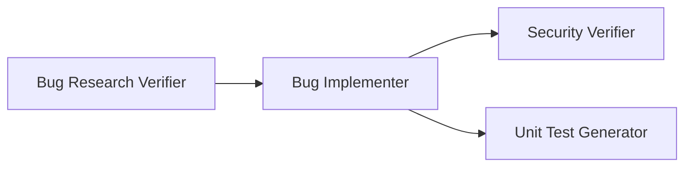

# Homework 4 — 4-Agent Bug Fixing Pipeline

## Project Overview

This project implements a **4-agent pipeline** for automated bug fixing. The pipeline takes a bug report through research verification, code implementation, security review, and unit test generation — producing auditable artifacts at every step.

The demo application (`demo-bug-fix/`) contains a Node.js/Express API with a real bug (API-404: type coercion mismatch causing 404 on valid user IDs). The pipeline is applied to this bug end-to-end.

---

## 4-Agent Pipeline Overview



**Full run order**:
1. Bug Researcher *(upstream, produces `codebase-research.md`)*
2. **Bug Research Verifier** — verifies research quality
3. Bug Planner *(upstream, produces `implementation-plan.md`)*
4. **Bug Implementer** — applies fixes, runs tests
5. **Security Verifier** — audits changed code
6. **Unit Test Generator** — generates and runs tests for changed code

---

## Repository Structure

```
homework-4/
├── README.md
├── HOWTORUN.md
├── STUDENT.md
├── agents/
│   ├── research-verifier.agent.md      # Task 1
│   ├── bug-implementer.agent.md        # Task 2
│   ├── security-verifier.agent.md      # Task 3
│   └── unit-test-generator.agent.md    # Task 4
├── skills/
│   ├── research-quality-measurement.md # Task 1.2 — quality rubric skill
│   └── unit-tests-FIRST.md             # Task 4.2 — FIRST principles skill
├── context/bugs/API-404/
│   ├── bug-context.md
│   ├── research/
│   │   ├── codebase-research.md
│   │   └── verified-research.md        # Output of Research Verifier
│   ├── implementation-plan.md
│   ├── fix-summary.md                  # Output of Bug Implementer
│   ├── security-report.md              # Output of Security Verifier
│   └── test-report.md                  # Output of Unit Test Generator
├── demo-bug-fix/                        # Application with bug fixed
│   ├── server.js
│   ├── package.json
│   ├── src/
│   │   ├── controllers/userController.js
│   │   └── routes/users.js
│   └── tests/
│       └── userController.test.js      # Generated by Unit Test Generator
└── docs/screenshots/
    └── README.md                       # Screenshot capture instructions
```

---

## How to Run the App

```bash
cd demo-bug-fix
npm install
npm start
# Server runs at http://localhost:3000
```

Test the fixed endpoints:
```bash
curl http://localhost:3000/api/users/123
# Returns: {"id":123,"name":"Alice Smith","email":"alice@example.com"}

curl http://localhost:3000/api/users
# Returns: full users array

curl http://localhost:3000/api/users/999
# Returns: {"error":"User not found"} — 404

curl http://localhost:3000/api/users/abc
# Returns: {"error":"Invalid user ID"} — 400
```

---

## How to Run the Pipeline

The pipeline is implemented as Claude Code agent markdown files. To run each agent:

### Step 1 — Research Verifier
```
# In Claude Code, invoke:
@agents/research-verifier.agent.md
# Input: context/bugs/API-404/research/codebase-research.md
# Output: context/bugs/API-404/research/verified-research.md
```

### Step 2 — Bug Implementer
```
# In Claude Code, invoke:
@agents/bug-implementer.agent.md
# Input: context/bugs/API-404/implementation-plan.md
# Output: context/bugs/API-404/fix-summary.md + code changes
```

### Step 3 — Security Verifier
```
# In Claude Code, invoke:
@agents/security-verifier.agent.md
# Input: context/bugs/API-404/fix-summary.md + changed files
# Output: context/bugs/API-404/security-report.md
```

### Step 4 — Unit Test Generator
```
# In Claude Code, invoke:
@agents/unit-test-generator.agent.md
# Input: context/bugs/API-404/fix-summary.md + changed files
# Output: demo-bug-fix/tests/userController.test.js + context/bugs/API-404/test-report.md
```

---

## Agent Descriptions

| Agent | File | Role |
|-------|------|------|
| Bug Research Verifier | `agents/research-verifier.agent.md` | Verifies every file:line reference and snippet in codebase research. Rates quality using the research-quality-measurement skill. |
| Bug Implementer | `agents/bug-implementer.agent.md` | Applies code changes exactly as specified in the implementation plan. Runs tests and produces fix-summary. |
| Security Verifier | `agents/security-verifier.agent.md` | Reviews only changed code for injection, validation gaps, secrets, and OWASP issues. Read-only. |
| Unit Test Generator | `agents/unit-test-generator.agent.md` | Generates unit tests for changed code only. Applies FIRST principles. Runs tests and reports results. |

---

## Skills Description

| Skill | File | Purpose |
|-------|------|---------|
| Research Quality Measurement | `skills/research-quality-measurement.md` | 5-dimension rubric (reference accuracy, snippet accuracy, completeness, traceability, planner usability) with EXCELLENT/GOOD/PARTIAL/WEAK/FAIL levels. Used by Research Verifier. |
| Unit Tests FIRST | `skills/unit-tests-FIRST.md` | Defines Fast, Independent, Repeatable, Self-validating, Timely principles with pass/fail criteria, anti-patterns, and a compliance checklist. Used by Unit Test Generator. |

---

## Generated Artifacts

| Artifact | Path | Produced By |
|----------|------|-------------|
| Verified research | `context/bugs/API-404/research/verified-research.md` | Research Verifier |
| Fix summary | `context/bugs/API-404/fix-summary.md` | Bug Implementer |
| Security report | `context/bugs/API-404/security-report.md` | Security Verifier |
| Test report | `context/bugs/API-404/test-report.md` | Unit Test Generator |
| Unit tests | `demo-bug-fix/tests/userController.test.js` | Unit Test Generator |

---

## Screenshots

See `docs/screenshots/README.md` for the list of screenshots to capture when running the pipeline interactively.

---

## Assumptions / Limitations

- The demo application uses an in-memory data store (no real database). The bug and fix are representative of a real-world type coercion issue.
- Agents are implemented as Claude Code `.agent.md` markdown instruction files, not as compiled binaries. They are invoked by referencing them in Claude Code sessions.
- The Bug Researcher and Bug Planner agents are upstream prerequisites. Their outputs (`codebase-research.md` and `implementation-plan.md`) are provided as pre-existing context in this repo.
- Security report findings are based on the actual changed code; no findings are fabricated.
- All test results are from real Jest execution (5/5 pass).
